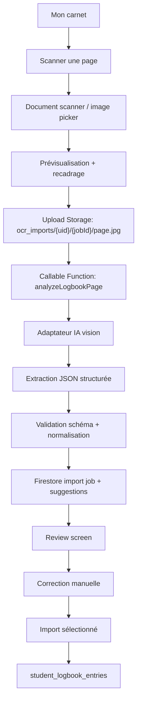

# CalyMob — Import carnet papier par photo/OCR

Version: 2026-05-14  
Statut: plan technique détaillé  
Périmètre: `Mon carnet` / import OCR assisté par IA / `student_logbook_entries`

## 1. Objectif

Ajouter dans CalyMob une fonction qui permet à un plongeur de photographier une page de carnet papier, d’en extraire automatiquement les plongées, puis de les importer dans `Mon carnet` après validation manuelle.

Le principe produit est volontairement prudent:

- l’OCR propose, l’utilisateur confirme;
- les champs sûrs sont pré-remplis;
- les champs incertains sont visibles et modifiables;
- rien n’est écrit dans le carnet final sans action explicite.

Pour atteindre l’objectif “fonctionner avec plusieurs formats de carnets”, une OCR classique ne suffit pas. Le système doit intégrer une couche IA vision/extraction, côté serveur, capable de comprendre la page comme un carnet de plongée et de produire des propositions structurées avec scores de confiance.

## 1.1 Pourquoi l’IA est nécessaire

La difficulté n’est pas seulement de lire du texte manuscrit. Il faut interpréter la mise en page et le contexte:

- `21` sous `Profondeur max` signifie mètres;
- `34` sous `Durée totale` signifie minutes;
- `14h30` est probablement l’heure de sortie;
- `Flavie` dans `Compagnons` devient un binôme;
- `nudibranche`, `poulpe`, `rascasse` vont dans les notes;
- une date `15/9` a besoin d’une année;
- un autre carnet peut placer les mêmes informations autrement.

Architecture de principe:

```text
photo -> nettoyage document -> IA vision/extraction -> JSON structuré -> validation -> review utilisateur -> import
```

L’IA ne reçoit jamais le droit d’écrire directement dans le carnet. Elle propose uniquement des champs, des scores de confiance et des avertissements.

## 2. État actuel dans CalyMob

CalyMob dispose déjà des briques nécessaires:

- Capture image: `image_picker`, `cunning_document_scanner`, `image_cropper`, `flutter_image_compress`.
- Backend: Firebase Functions Node 20 dans `CalyMob/functions/index.js`.
- Stockage: `firebase_storage`.
- Persistance carnet: `clubs/{clubId}/student_logbook_entries`.
- Modèle: `lib/models/student_logbook_entry.dart`.
- Service CRUD: `lib/services/student_logbook_service.dart`.
- Écran liste: `lib/screens/training/mon_carnet_screen.dart`.
- Écran édition: `lib/screens/training/logbook_entry_screen.dart`.

Les champs existants utiles:

```text
student_logbook_entries/{entryId}
  member_id
  member_name
  source
  date
  location_id?
  location_name
  country?
  depth_max_meters?
  duration_minutes?
  counters: { exo?, nitrox?, deco?, dp?, sf?, nuit?, mer? }
  buddies[]
  notes?
  validation_status
  entry_time? / entry_time_str?      (déjà supporté par l’écran)
  exit_time? / exit_time_str?        (déjà supporté par l’écran)
  combi?
  tank?
  lestage_kg?
```

## 3. Parcours utilisateur cible

1. L’utilisateur ouvre `Mon carnet`.
2. Il appuie sur un bouton `Scanner une page`.
3. Il photographie une page ou choisit une photo existante.
4. CalyMob recadre/redresse/comprime l’image.
5. L’image est envoyée à Firebase Storage.
6. Une Cloud Function analyse l’image.
7. CalyMob affiche les plongées détectées sous forme de brouillon.
8. L’utilisateur corrige les champs incertains.
9. Il importe les lignes choisies.
10. Les entrées sont écrites dans `student_logbook_entries` avec `source: ocr_import`.

## 4. Architecture proposée



La couche IA reste exclusivement côté Cloud Functions. L’app mobile ne contient aucune clé API et ne contacte jamais directement un fournisseur IA.

### 4.1 Frontend Flutter

Nouveaux fichiers proposés:

```text
lib/models/logbook_ocr_import.dart
lib/services/logbook_ocr_import_service.dart
lib/screens/training/logbook_ocr_capture_screen.dart
lib/screens/training/logbook_ocr_review_screen.dart
lib/widgets/logbook_ocr_confidence_field.dart
```

Modifications existantes:

```text
lib/screens/training/mon_carnet_screen.dart
  - ajouter action "Scanner une page"
  - ajouter menu FAB ou second bouton flottant

lib/screens/training/logbook_entry_screen.dart
  - optionnel: constructeur prefill depuis suggestion OCR
  - sinon édition inline dans l’écran review

lib/services/student_logbook_service.dart
  - méthode batchCreateFromOcrSuggestions(...)
```

### 4.2 Backend Firebase Functions

Nouvelles fonctions:

```text
analyzeLogbookPage(callable)
  Input: clubId, storagePath, localeHints?, defaultYear?, pageContext?
  Output: importJobId, rows[]

confirmLogbookOcrImport(callable)
  Input: clubId, importJobId, acceptedRows[]
  Output: createdEntryIds[]
```

`analyzeLogbookPage` peut rester synchrone pour un MVP si le temps de réponse est acceptable. Pour une production robuste, prévoir un mode job asynchrone:

```text
createLogbookOcrJob -> upload -> processLogbookOcrJob trigger -> listen Firestore job
```

## 5. Modèle de données OCR

Collection suggérée:

```text
clubs/{clubId}/logbook_ocr_imports/{importJobId}
  member_id: string
  created_at
  updated_at
  status: "uploaded" | "processing" | "review" | "imported" | "failed"
  storage_path: string
  image_sha256?: string
  default_year?: number
  page_label?: string
  parser_version: string
  rows: OcrSuggestedRow[]
  error_message?: string
```

Structure `OcrSuggestedRow`:

```ts
type OcrSuggestedRow = {
  rowId: string;
  selected: boolean;
  confidence: number;             // 0..1 score global
  warnings: string[];
  rawText?: string;
  sourceBoundingBox?: {
    x: number; y: number; width: number; height: number;
  };
  fields: {
    diveNumber?: OcrField<number>;
    date?: OcrField<string>;       // ISO yyyy-mm-dd si année connue
    dateRaw?: OcrField<string>;    // ex: "15/9"
    entryTime?: OcrField<string>;  // HH:mm
    exitTime?: OcrField<string>;   // HH:mm
    locationName?: OcrField<string>;
    country?: OcrField<string>;    // BE, FR, HR...
    depthMaxMeters?: OcrField<number>;
    durationMinutes?: OcrField<number>;
    deco?: OcrField<boolean>;
    night?: OcrField<boolean>;
    sea?: OcrField<boolean>;
    buddies?: OcrField<string[]>;
    notes?: OcrField<string>;
  };
};

type OcrField<T> = {
  value: T;
  confidence: number;
  raw?: string;
  needsReview?: boolean;
};
```

Waarom dit zo fijnmazig is: één rij kan globaal bruikbaar zijn terwijl bijvoorbeeld alleen `locationName` onzeker is. De UI kan dan precies het juiste veld markeren.

## 6. Mapping naar `student_logbook_entries`

| OCR veld | Firestore veld | Regel |
|---|---|---|
| `date.value` | `date` | `Timestamp`; als jaar ontbreekt, vraag gebruiker of gebruik `defaultYear` |
| `entryTime` | `entry_time_str` | Alleen opslaan als zeker of bevestigd |
| `exitTime` | `exit_time_str` | Alleen opslaan als zeker of bevestigd |
| `locationName` | `location_name` | Verplicht; bij leeg: `Lieu non identifié` + warning |
| `country` | `country` | ISO-code waar mogelijk |
| `depthMaxMeters` | `depth_max_meters` | Number |
| `durationMinutes` | `duration_minutes` | Number |
| `deco` | `counters.deco` | Alleen `true` opslaan |
| `night` | `counters.nuit` | Alleen `true` opslaan |
| `sea` | `counters.mer` | Alleen `true` opslaan |
| `buddies` | `buddies[]` | Externe buddies als `LogbookBuddy(name: ...)` |
| `notes` + warnings | `notes` | Vrije tekst |
| import metadata | extras | `source_image_path`, `ocr_import_id`, `ocr_confidence`, `ocr_reviewed_at` |

Entry payload voorbeeld:

```json
{
  "member_id": "uid",
  "source": "ocr_import",
  "date": "Timestamp(2025-09-15)",
  "location_name": "Blue Marine Cave - Kuk",
  "country": "HR",
  "depth_max_meters": 39,
  "duration_minutes": 46,
  "counters": { "mer": true },
  "buddies": [
    { "name": "Flo" }
  ],
  "notes": "OCR: mostel/grotte?, rascasse. Ligne manuscrite partiellement incertaine.",
  "validation_status": "personal",
  "ocr_import_id": "abc123",
  "ocr_confidence": 0.78
}
```

## 7. OCR / analyse

### 7.1 IA vision — choix d’architecture

Pour le MVP, utiliser une extraction multimodale directe:

```text
image -> modèle vision IA -> JSON structuré
```

Cette stratégie est la plus adaptée aux carnets manuscrits car elle laisse le modèle comprendre simultanément:

- la structure de la page;
- les labels imprimés;
- l’écriture manuscrite;
- les lignes de tableau;
- les cachets/signatures qui chevauchent parfois les notes;
- les variantes de formats.

Une architecture alternative pourra être ajoutée plus tard:

```text
image -> OCR classique avec positions -> IA interprétation -> JSON structuré
```

Mais cette option est plus complexe et l’OCR classique reste fragile sur l’écriture manuscrite.

### 7.2 Adaptateur IA provider-agnostic

Ne pas lier CalyMob à un fournisseur directement dans le code applicatif. Créer un adaptateur côté Functions:

```text
functions/src/logbookOcr/aiExtractor.js
functions/src/logbookOcr/openAiVisionExtractor.js
functions/src/logbookOcr/mockExtractor.js
```

Interface conceptuelle:

```ts
type LogbookAiExtractor = {
  extractLogbookPage(input: {
    imageBuffer: Buffer;
    mimeType: "image/jpeg" | "image/png" | "image/webp";
    defaultYear?: number;
    localeHints: string[];
    pageContext?: Record<string, unknown>;
  }): Promise<LogbookAiExtractionResult>;
};
```

Configuration via environnement:

```text
LOGBOOK_OCR_AI_PROVIDER=openai
LOGBOOK_OCR_AI_MODEL=<model>
LOGBOOK_OCR_MAX_IMAGE_MB=8
LOGBOOK_OCR_STORE_DEBUG=false
LOGBOOK_OCR_TIMEOUT_MS=45000
```

`mockExtractor` sert aux tests unitaires, à la démo locale et au développement UI sans coûts IA.

### 7.3 Contrat de sortie IA

Le modèle doit retourner uniquement du JSON validable:

```json
{
  "page": {
    "detectedFormat": "lifras_carnet_table",
    "language": "fr",
    "overallConfidence": 0.84,
    "warnings": []
  },
  "rows": [
    {
      "rowId": "row-383",
      "confidence": 0.89,
      "warnings": [],
      "fields": {
        "diveNumber": { "value": 383, "confidence": 0.98 },
        "dateRaw": { "value": "24/8", "confidence": 0.96 },
        "locationName": { "value": "Vodelée", "confidence": 0.94 },
        "depthMaxMeters": { "value": 21, "confidence": 0.98 },
        "durationMinutes": { "value": 34, "confidence": 0.97 },
        "exitTime": { "value": "14:30", "confidence": 0.88 },
        "buddies": { "value": ["Flavie"], "confidence": 0.75 },
        "notes": { "value": "", "confidence": 0.5 }
      }
    }
  ]
}
```

Règles backend:

- valider le JSON avant tout stockage;
- marquer `needsReview=true` si confidence absente ou basse;
- rejeter les valeurs incohérentes: profondeur négative, durée énorme, heure invalide;
- retry une seule fois si le JSON est invalide;
- ne jamais écrire directement dans `student_logbook_entries` depuis l’étape IA.

### 7.4 Formats multiples

La fonction doit accepter des carnets variés:

- carnet LIFRAS avec colonnes verticales;
- tableau générique;
- vieux carnets papier;
- labels français, néerlandais ou mixtes;
- une page entière ou une page partielle;
- photo inclinée, ombres légères, cachets et stickers.

La sortie standardise toujours vers le même modèle CalyMob. Si `detectedFormat = unknown` ou `overallConfidence < 0.55`, l’UI doit imposer une vérification stricte et désactiver l’import global.

### 7.5 MVP

Pour un premier MVP, utiliser un seul appel backend “vision + extraction structurée”:

1. Convertir l’image en JPEG compressé raisonnable.
2. Envoyer l’image au modèle OCR/vision.
3. Demander une réponse JSON strictement typée.
4. Valider le JSON côté backend.
5. Normaliser les dates, pays, nombres, durées.
6. Retourner des suggestions avec confidence et warnings.

### 7.6 Prompt d’extraction

Prompt conceptuel:

```text
Tu lis une page de carnet de plongée manuscrit.
Extrais chaque ligne de plongée visible.
Retourne uniquement du JSON valide.
Ne devine pas silencieusement: si un champ est incertain, indique needsReview=true.
Préserve le texte manuscrit utile dans notes.
Colonnes attendues:
N°, Date, Lieu, Profondeur max, Durée totale, Heure de sortie,
Paliers, Remarques/Découvertes/Faune/Flore, Moniteur/Compagnons.
```

### 7.7 Normalisation métier

Règles utiles:

- `Kuk`, `Croatie`, `Plavnik`, `Seline` => `country = HR` si le contexte de page est cohérent.
- `Nuit`, `Night`, heure tardive confirmée => `counters.nuit = true`.
- `Mer`, pays côtier, plongées Croatie/Égypte/France mer => proposer `counters.mer = true`, mais confidence moyenne si non écrit.
- Date sans année: utiliser `defaultYear` fourni par l’utilisateur ou demander dans le review screen.
- Durée et heure:
  - si `entryTime + duration` connus, dériver `exitTime`;
  - si `exitTime + duration` connus, dériver `entryTime` seulement après confirmation;
  - éviter les dérivations silencieuses dans l’import initial.

## 8. UX en détail

### 8.1 Entrée depuis `Mon carnet`

Option A: FAB étendu avec menu.

```text
┌────────────────────────────────────┐
│ ←  Mon carnet                 🎓   │
│                                    │
│ [ Plongées ] [ Piscine ]           │
│                                    │
│ 2026  2025  2024  Tout             │
│                                    │
│ 21 avr. 2026 · Vodelée             │
│ 22 m · 45 min · mer                │
│                                    │
│                         ┌──────┐   │
│                         │  +   │   │
│                         └──────┘   │
└────────────────────────────────────┘

Tap +

┌──────────────────────────┐
│ Nouvelle plongée         │
│                          │
│ ✍️  Encoder manuellement │
│ 📷  Scanner une page     │
└──────────────────────────┘
```

Option B: deux boutons dans le header:

```text
Mon carnet                         📷  +
```

Recommandation: Option A. Elle évite de charger le header et garde le comportement actuel de la plus-knop.

### 8.2 Capture

```text
┌────────────────────────────────────┐
│ ← Scanner une page                 │
│                                    │
│ Place la page dans le cadre.       │
│ La page entière doit être visible. │
│                                    │
│ ┌────────────────────────────────┐ │
│ │                                │ │
│ │        zone caméra             │ │
│ │                                │ │
│ └────────────────────────────────┘ │
│                                    │
│ [ Choisir une photo ]      [●]     │
└────────────────────────────────────┘
```

Remarques UX:

- accepter photo existante et caméra;
- guider sans long texte;
- permettre rotation/recadrage;
- afficher un avertissement si l’image est floue ou trop sombre.

### 8.3 Prévisualisation

```text
┌────────────────────────────────────┐
│ ← Vérifier la photo                │
│                                    │
│ ┌────────────────────────────────┐ │
│ │  image recadrée de la page     │ │
│ └────────────────────────────────┘ │
│                                    │
│ Année de ces plongées              │
│ [ 2025 ▼ ]                         │
│                                    │
│ [ Reprendre ]          [ Analyser ]│
└────────────────────────────────────┘
```

Le champ `Année` est important parce que beaucoup de carnets papier notent seulement `15/9`.

### 8.4 Analyse en cours

```text
┌────────────────────────────────────┐
│ Analyse du carnet                  │
│                                    │
│      ○                             │
│                                    │
│ Lecture de la page…                │
│ Détection des lignes de plongée…   │
│                                    │
│ Cela peut prendre quelques secondes│
└────────────────────────────────────┘
```

### 8.5 Review des lignes détectées

```text
┌────────────────────────────────────┐
│ ← Importer depuis photo            │
│ 5 plongées trouvées · 2 à vérifier │
│                                    │
│ [ Tout ] [ À vérifier ] [ Prêtes ] │
│                                    │
│ ☑ N°383 · 24/08/2025               │
│   Vodelée                          │
│   21 m · 34 min · sortie 14:30     │
│   Binôme: Flavie                   │
│   ✓ bonne confiance                │
│                                    │
│ ☑ N°384 · 11/09/2025 ?             │
│   Kornjacol / Kornjaca ?           │
│   Kuk · Croatie                    │
│   19 m · 55 min                    │
│   ⚠ lieu et date à vérifier        │
│                                    │
│ ☑ N°385 · 14/09/2025               │
│   Mari Plavnik ? · Kuk · Croatie   │
│   20 m · 49 min                    │
│   ⚠ nom du site à vérifier         │
│                                    │
│ [ Importer 5 plongées ]            │
└────────────────────────────────────┘
```

Chaque carte est tappable pour ouvrir l’édition détaillée.

### 8.6 Édition d’une suggestion

```text
┌────────────────────────────────────┐
│ ← Vérifier la plongée              │
│ N°385 · confiance 76%              │
│                                    │
│ Date                               │
│ [ 14/09/2025              ✓ ]      │
│                                    │
│ Lieu                               │
│ [ Mari Plavnik ?          ⚠ ]      │
│ Proposition: Mari Plavnik          │
│ Texte lu: "MARI plavnik"           │
│                                    │
│ Pays                               │
│ [ HR - Croatie            ✓ ]      │
│                                    │
│ Profondeur max                     │
│ [ 20 m                   ✓ ]       │
│                                    │
│ Durée                              │
│ [ 49 min                 ✓ ]       │
│                                    │
│ Notes                              │
│ [ nudibranche, rascasse           ]│
│                                    │
│ [ Ignorer ]              [ Valider ]│
└────────────────────────────────────┘
```

Champ incertain:

```text
┌────────────────────────────────────┐
│ Lieu                         ⚠     │
│ ┌──────────────────────────────┐   │
│ │ Mari Plavnik ?               │   │
│ └──────────────────────────────┘   │
│ Faible confiance · vérifie ce champ│
└────────────────────────────────────┘
```

### 8.7 Résultat

```text
┌────────────────────────────────────┐
│ Import terminé                     │
│                                    │
│ 5 plongées ajoutées à Mon carnet.  │
│                                    │
│ [ Voir dans mon carnet ]           │
└────────────────────────────────────┘
```

## 9. Design visuel

Suivre le langage actuel de `Mon carnet`:

- `OceanGradientBackground` avec `CreatureSet.jellyfishAndBubbles`;
- cartes blanches ou verre léger selon le pattern existant;
- états de confiance discrets:
  - vert/bleu: champ fiable;
  - orange: champ à vérifier;
  - gris: champ absent;
- pas de longs paragraphes dans l’app;
- privilégier icônes: caméra, image, warning, check, edit.

## 10. Sécurité et règles Firestore

Contraintes:

- un membre ne peut créer/voir que ses propres imports OCR;
- le Storage path doit être sous son UID;
- la Cloud Function vérifie `context.auth.uid`;
- `member_id` dans l’import final doit être forcé côté serveur ou contrôlé côté backend;
- ne jamais accepter un `member_id` arbitraire venant du client.

Storage:

```text
clubs/{clubId}/ocr_imports/{uid}/{jobId}/page.jpg
```

Firestore:

```text
clubs/{clubId}/logbook_ocr_imports/{jobId}
```

Règles à prévoir:

- read/write import job: owner seulement;
- create entries: owner seulement via règles existantes ou via callable confirmée;
- delete image après import ou après délai de rétention.

## 11. Confidentialité et rétention

Une page de carnet peut contenir noms de binômes, signatures, cachets et lieux. Il faut donc:

- afficher clairement que la photo est utilisée pour remplir le carnet;
- supprimer automatiquement l’image source après import confirmé, sauf option debug/admin;
- garder seulement:
  - les champs importés;
  - une trace technique `ocr_import_id`;
  - éventuellement un petit `rawText` si utile, mais pas par défaut;
- éviter de stocker de longues transcriptions de signatures.

Rétention suggérée:

- image source: 7 jours si non importé, suppression immédiate après import si possible;
- import job: 30 jours pour reprise/correction;
- entries carnet: conservation normale.

## 12. Gestion des erreurs

Cas à traiter:

| Cas | UX |
|---|---|
| photo floue | “La page est difficile à lire. Reprendre la photo ?” |
| aucune ligne détectée | proposer recadrage ou import manuel |
| année manquante | demander l’année avant import |
| fonction timeout | garder le job en `processing`, permettre refresh |
| JSON invalide backend | retry une fois, puis `failed` |
| doublons probables | avertir avant import |

Détection doublons:

```text
Même member_id + même date + même location_name + même depth/duration proche
=> warning "Cette plongée ressemble à une entrée existante"
```

## 13. Tests

### 13.1 Unit tests Dart

À ajouter:

```text
test/models/logbook_ocr_import_test.dart
test/services/logbook_ocr_import_mapping_test.dart
```

Couverture:

- parsing suggestion JSON;
- conversion suggestion -> `StudentLogbookEntry`;
- date sans année;
- confidence flags;
- buddies externes;
- counters mer/nuit/deco.

### 13.2 Tests Functions

À ajouter dans `CalyMob/functions`:

```text
__tests__/logbookOcrParser.test.js
__tests__/logbookOcrImport.test.js
```

Couverture:

- validation schéma JSON;
- normalisation pays;
- normalisation dates;
- rejet d’un autre `member_id`;
- création batch idempotente.

### 13.3 Tests manuels

Jeu de photos:

1. photo nette pleine page;
2. page inclinée;
3. page partiellement ombrée;
4. écriture difficile;
5. page avec 1 seule ligne;
6. page avec cachets/signatures qui chevauchent les notes.

Critères d’acceptation:

- au moins 80% des champs numériques lus correctement sur photos nettes;
- aucune écriture finale sans confirmation;
- chaque champ incertain est modifiable avant import;
- import batch crée bien des entrées visibles dans `Mon carnet`.

## 14. Phasage d’implémentation

### Phase 1 — Prototype local / backend minimal

Objectif: prouver l’extraction sur 5-10 photos.

- Créer schéma JSON `OcrSuggestedRow`.
- Créer l’interface `LogbookAiExtractor`.
- Ajouter `mockExtractor` pour tests et développement UI.
- Ajouter un premier extracteur IA vision derrière une config d’environnement.
- Formaliser le prompt et le schéma de sortie.
- Créer fonction backend `analyzeLogbookPage`.
- Retourner suggestions sans écrire dans `student_logbook_entries`.
- Tester avec photos réelles de carnets.

Livrable: écran debug ou script callable + exemples JSON.

### Phase 2 — UI capture + review

Objectif: parcours utilisateur complet sans import définitif.

- Ajouter bouton `Scanner une page`.
- Ajouter capture/photo picker.
- Ajouter preview + année.
- Ajouter écran review des suggestions.
- Ajouter édition inline.

Livrable: l’utilisateur peut photographier une page et corriger les suggestions.

### Phase 3 — Import sécurisé

Objectif: écrire dans le carnet.

- Ajouter `confirmLogbookOcrImport`.
- Ajouter batch create côté service.
- Ajouter détection doublons.
- Ajouter metadata `source: ocr_import`.
- Ajouter résultat d’import.

Livrable: les plongées validées apparaissent dans `Mon carnet`.

### Phase 4 — Qualité production

Objectif: rendre fiable et maintenable.

- Rétention Storage.
- Monitoring erreurs.
- Timeout/retry/rate-limit autour des appels IA.
- Observabilité coûts/quotas par club/utilisateur.
- Configuration provider/modèle via environnement Functions.
- Tests unitaires.
- Feature flag `logbookOcrImportEnabled`.
- Garde-fous coût/quotas.
- Amélioration prompt/parser selon photos réelles.

## 15. Décisions ouvertes

1. Faut-il stocker l’image source après import, ou la supprimer immédiatement?
2. L’année par défaut vient-elle du filtre annuel actuel de `Mon carnet`, d’un champ demandé, ou des deux?
3. Souhaite-t-on importer des pages entières seulement, ou aussi une ligne isolée?
4. Le review screen doit-il être uniquement inline, ou réutiliser `LogbookEntryScreen` en mode prefill?
5. Les imports OCR doivent-ils compter comme `validation_status: personal` ou avoir un statut spécial `ocr_reviewed`?
6. Faut-il exposer une option admin/support pour revoir les échecs OCR?

## 16. Recommandation finale

Construire d’abord un MVP prudent:

- capture photo;
- analyse backend;
- review écran;
- import uniquement après confirmation;
- champ `notes` enrichi avec les incertitudes.

Ne pas viser une automatisation invisible. La valeur vient du gain de temps: CalyMob remplit 80-90% de la fiche, et l’utilisateur corrige les 10-20% ambigus avant sauvegarde. C’est exactement le bon compromis pour du carnet manuscrit.
