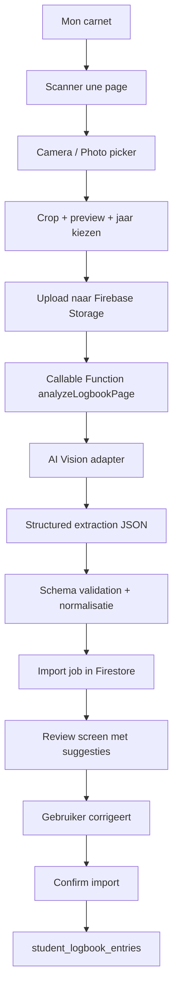

# CalyMob — Papieren logboek importeren via foto/OCR

Datum: 2026-05-14  
Status: technisch plan + tekstmockups  
Scope: `Mon carnet`, AI-ondersteunde OCR-import, review-flow, opslag in `student_logbook_entries`

## 1. Doel

Een gebruiker moet in CalyMob een foto kunnen nemen van een handgeschreven duiklogboekpagina. De app analyseert de foto, haalt de duiken eruit, vult zoveel mogelijk carnet-velden vooraf in, en toont daarna een controlescherm waar de gebruiker alles kan verbeteren vooraleer het definitief in `Mon carnet` komt.

Belangrijk principe: OCR mag voorstellen, maar niet stilletjes beslissen. Zeker bij handschrift moeten twijfelgevallen zichtbaar blijven.

Voor het beoogde kwaliteitsniveau is klassieke OCR alleen onvoldoende. De functie moet een AI-laag bevatten die de foto begrijpt als logboekpagina, ook wanneer layout, taal, handschrift en kolomvolgorde verschillen.

## 2. Waarom dit haalbaar is

De testfoto toont dat de combinatie van tabelherkenning, handschriftinterpretatie en duikcontext voldoende sterk is om bruikbare gegevens te extraheren:

- duiknummer;
- datum;
- plaats;
- max. diepte;
- duur;
- uitgangstijd;
- buddy/compagnon;
- opmerkingen, fauna/flora en incidenten.

CalyMob heeft bovendien al de technische bouwstenen:

- `image_picker` voor foto nemen of kiezen;
- `cunning_document_scanner` voor pagina-scan;
- `image_cropper` en `flutter_image_compress` voor bijsnijden/compressie;
- `firebase_storage` voor tijdelijke opslag;
- `cloud_functions` voor server-side analyse;
- `student_logbook_entries` als bestaande carnet-collectie;
- `LogbookEntryScreen` en `StudentLogbookService` voor manuele of bestaande entries.

## 2.1 Waarom AI noodzakelijk is

Deze functie moet niet alleen tekst lezen, maar betekenis uit een papieren logboek halen. Dat is een ander probleem dan klassieke OCR.

Klassieke OCR kan bijvoorbeeld losse tekens of woorden vinden:

```text
383
24/8
Vodelée
21
34
14h30
Flavie
```

Maar voor automatische carnet-import moet de app begrijpen:

- `383` is een duiknummer, geen diepte of duur;
- `24/8` is een datum zonder jaar;
- `21` staat onder `Profondeur max` en betekent meter;
- `34` staat onder `Durée totale` en betekent minuten;
- `14h30` is waarschijnlijk `Heure de sortie`;
- `Flavie` staat in `Compagnons` en hoort bij `buddies`;
- `nudibranche`, `poulpe`, `rascasse` horen in `notes`;
- bij een ander carnet kunnen dezelfde velden horizontaal, verticaal of met andere labels staan.

Daarom moet de analyseketen AI-vision gebruiken:

```text
foto -> document cleanup -> AI vision/extractie -> gestructureerde JSON -> validatie -> review -> import
```

De AI krijgt geen schrijfrechten op het carnet. De AI produceert alleen voorstellen met confidence-scores. CalyMob valideert het schema, toont alles aan de gebruiker, en schrijft pas na bevestiging.

## 3. Bestaande code-aansluitpunten

Relevante bestanden:

```text
CalyMob/lib/screens/training/mon_carnet_screen.dart
CalyMob/lib/screens/training/logbook_entry_screen.dart
CalyMob/lib/screens/training/logbook_entry_detail_screen.dart
CalyMob/lib/models/student_logbook_entry.dart
CalyMob/lib/services/student_logbook_service.dart
CalyMob/functions/index.js
CalyMob/pubspec.yaml
```

Bestaand Firestore-pad:

```text
clubs/{clubId}/student_logbook_entries/{entryId}
```

Bestaande kernvelden:

```text
member_id
member_name
source
date
location_id?
location_name
country?
depth_max_meters?
duration_minutes?
counters: { exo?, nitrox?, deco?, dp?, sf?, nuit?, mer? }
buddies[]
notes?
validation_status
entry_time_str?
exit_time_str?
combi?
tank?
lestage_kg?
```

Voor OCR-import voegen we best metadata toe via `extras`, zonder het basismodel te breken:

```text
source: "ocr_import"
ocr_import_id
ocr_confidence
ocr_reviewed_at
source_image_path?
ocr_warnings?
```

## 4. Gebruikersflow

1. Gebruiker opent `Mon carnet`.
2. Gebruiker kiest `Scanner une page`.
3. App opent camera of fotokiezer.
4. Gebruiker maakt foto van de logboekpagina.
5. App toont preview, eventueel met crop/rotate.
6. Gebruiker kiest het jaar van de pagina als dat niet op de pagina staat.
7. App uploadt de foto naar Firebase Storage.
8. Cloud Function analyseert de foto.
9. App toont gevonden duiken als importvoorstellen.
10. Gebruiker corrigeert twijfelgevallen.
11. Gebruiker kiest welke rijen geïmporteerd worden.
12. App schrijft gevalideerde entries naar `student_logbook_entries`.

## 5. Architectuur



De AI-laag zit uitsluitend server-side in de Cloud Function. De mobiele app bevat geen API-sleutels en praat nooit rechtstreeks met een AI-provider.

## 6. Nieuwe frontend-onderdelen

Aanbevolen nieuwe bestanden:

```text
lib/models/logbook_ocr_import.dart
lib/services/logbook_ocr_import_service.dart
lib/screens/training/logbook_ocr_capture_screen.dart
lib/screens/training/logbook_ocr_review_screen.dart
lib/widgets/logbook_ocr_confidence_field.dart
lib/widgets/logbook_ocr_suggestion_card.dart
```

Aanpassingen aan bestaande bestanden:

```text
mon_carnet_screen.dart
  - plusknop uitbreiden naar menu:
    - Encoder manuellement
    - Scanner une page

student_logbook_service.dart
  - batchCreateFromOcrSuggestions(...)

logbook_entry_screen.dart
  - optioneel: prefill-constructor voor één OCR-suggestie
  - alternatief: alle correctie gebeurt inline in review screen
```

Mijn aanbeveling: correctie inline in het review screen voor batch-import. `LogbookEntryScreen` blijft nuttig voor later individueel bewerken.

## 7. Backend functies

### 7.1 `analyzeLogbookPage`

Callable Cloud Function.

Input:

```json
{
  "clubId": "calypso",
  "storagePath": "clubs/calypso/ocr_imports/uid/jobId/page.jpg",
  "defaultYear": 2025,
  "localeHints": ["fr", "nl"],
  "pageContext": {
    "expectedCountry": "HR",
    "knownDiveNumberRange": "383-387"
  }
}
```

Output:

```json
{
  "importJobId": "jobId",
  "status": "review",
  "rows": []
}
```

Taken:

- auth controleren;
- storage path controleren;
- afbeelding downloaden;
- afbeelding normaliseren voor AI-analyse;
- AI-vision provider aanroepen via backend adapter;
- response afdwingen als strikt JSON-schema;
- JSON valideren;
- datums, landen, cijfers en duur normaliseren;
- importjob bewaren;
- suggesties teruggeven.

### 7.1.1 AI-adapter

Maak de AI-provider vervangbaar via een kleine adapterlaag. De rest van CalyMob mag niet weten welke provider of welk model gebruikt wordt.

Interface:

```ts
type LogbookAiExtractor = {
  extractLogbookPage(input: {
    imageBuffer: Buffer;
    mimeType: "image/jpeg" | "image/png" | "image/webp";
    defaultYear?: number;
    localeHints: string[];
    pageContext?: Record<string, unknown>;
  }): Promise<LogbookAiExtractionResult>;
};
```

Implementaties:

```text
functions/src/logbookOcr/aiExtractor.js
functions/src/logbookOcr/openAiVisionExtractor.js
functions/src/logbookOcr/mockExtractor.js
```

`mockExtractor` is nodig voor tests en lokale ontwikkeling. Zo kunnen UI en importlogica gebouwd worden zonder telkens echte AI-kosten te maken.

### 7.1.2 AI-outputcontract

De AI mag alleen JSON teruggeven dat aan het schema voldoet:

```json
{
  "page": {
    "detectedFormat": "lifras_carnet_table",
    "language": "fr",
    "overallConfidence": 0.84,
    "warnings": []
  },
  "rows": [
    {
      "rowId": "row-383",
      "confidence": 0.89,
      "warnings": [],
      "fields": {
        "diveNumber": { "value": 383, "confidence": 0.98 },
        "dateRaw": { "value": "24/8", "confidence": 0.96 },
        "locationName": { "value": "Vodelée", "confidence": 0.94 },
        "depthMaxMeters": { "value": 21, "confidence": 0.98 },
        "durationMinutes": { "value": 34, "confidence": 0.97 },
        "exitTime": { "value": "14:30", "confidence": 0.88 },
        "buddies": { "value": ["Flavie"], "confidence": 0.75 },
        "notes": { "value": "", "confidence": 0.5 }
      }
    }
  ]
}
```

Backendregels:

- JSON schema valideren vóór opslag;
- onbekende velden negeren of in `rawAiResponseDebug` bewaren alleen in debugmodus;
- elk veld zonder confidence krijgt automatisch `needsReview = true`;
- waarden buiten normale grenzen markeren:
  - diepte `< 0` of `> 120`;
  - duur `< 0` of `> 300`;
  - ongeldige tijd;
  - datum buiten realistische range;
- AI mag geen definitieve Firestore-entry maken.

### 7.2 `confirmLogbookOcrImport`

Callable Cloud Function of client-side batch via bestaande service.

Input:

```json
{
  "clubId": "calypso",
  "importJobId": "jobId",
  "acceptedRows": ["row-383", "row-384"],
  "overrides": {
    "row-384": {
      "locationName": "Kornjaca - Kuk",
      "date": "2025-09-11"
    }
  }
}
```

Output:

```json
{
  "createdEntryIds": ["entryA", "entryB"],
  "skippedRows": []
}
```

Taken:

- eigenaar controleren;
- doublons detecteren;
- alleen geselecteerde rijen importeren;
- `member_id` server-side afdwingen;
- metadata toevoegen;
- importjob als `imported` markeren.

## 8. Firestore-model voor importjobs

Nieuwe collectie:

```text
clubs/{clubId}/logbook_ocr_imports/{importJobId}
```

Document:

```json
{
  "member_id": "uid",
  "status": "review",
  "storage_path": "clubs/calypso/ocr_imports/uid/jobId/page.jpg",
  "default_year": 2025,
  "parser_version": "logbook-ocr-v1",
  "created_at": "serverTimestamp",
  "updated_at": "serverTimestamp",
  "rows": []
}
```

Rijstructuur:

```json
{
  "rowId": "row-383",
  "selected": true,
  "confidence": 0.89,
  "warnings": [],
  "rawText": "383 24/8 Vodelée 21 34 14h30 Flavie",
  "fields": {
    "diveNumber": { "value": 383, "confidence": 0.98 },
    "date": { "value": "2025-08-24", "confidence": 0.91 },
    "dateRaw": { "value": "24/8", "confidence": 0.96 },
    "exitTime": { "value": "14:30", "confidence": 0.88 },
    "locationName": { "value": "Vodelée", "confidence": 0.94 },
    "depthMaxMeters": { "value": 21, "confidence": 0.98 },
    "durationMinutes": { "value": 34, "confidence": 0.97 },
    "buddies": { "value": ["Flavie"], "confidence": 0.75 },
    "notes": { "value": "", "confidence": 0.5 }
  }
}
```

## 9. Mapping naar carnet-entry

| OCR-suggestie | `student_logbook_entries` | Opmerking |
|---|---|---|
| `date.value` | `date` | `Timestamp` |
| `entryTime.value` | `entry_time_str` | Optioneel |
| `exitTime.value` | `exit_time_str` | Optioneel |
| `locationName.value` | `location_name` | Verplicht, fallback `Lieu non identifié` |
| `country.value` | `country` | ISO-code, bv. `HR`, `BE`, `FR` |
| `depthMaxMeters.value` | `depth_max_meters` | Number |
| `durationMinutes.value` | `duration_minutes` | Number |
| `deco.value` | `counters.deco` | Alleen true opslaan |
| `night.value` | `counters.nuit` | Alleen true opslaan |
| `sea.value` | `counters.mer` | Alleen true opslaan |
| `buddies.value` | `buddies[]` | Externe buddies |
| `notes.value` | `notes` | Inclusief OCR-twijfels |

Voorbeeld output-entry:

```json
{
  "member_id": "uid",
  "source": "ocr_import",
  "date": "Timestamp(2025-09-15)",
  "location_name": "Blue Marine Cave - Kuk",
  "country": "HR",
  "depth_max_meters": 39,
  "duration_minutes": 46,
  "counters": { "mer": true },
  "buddies": [{ "name": "Flo" }],
  "notes": "OCR: mostel/grotte?, rascasse. Site partiellement incertain.",
  "validation_status": "personal",
  "ocr_import_id": "jobId",
  "ocr_confidence": 0.78
}
```

## 10. AI-extractie voor meerdere logboekformaten

De ambitie “werkt ook met andere formaten” betekent dat we geen vaste template-parser mogen bouwen. We bouwen wel een standaard outputmodel, maar de input mag variëren.

Ondersteunde inputvarianten in scope:

- LIFRAS-achtig carnet met verticale kolommen;
- oude papieren duikboekjes;
- vrije tabel met labels zoals `Date`, `Lieu`, `Depth`, `Time`;
- Nederlandstalige labels zoals `Datum`, `Duikstek`, `Max diepte`, `Duiktijd`;
- Franstalige labels zoals `Date`, `Lieu`, `Profondeur max`, `Durée totale`;
- één pagina met meerdere duiken;
- één foto met een deel van een pagina;
- scheve foto, lichte schaduw, stempels, stickers, handtekeningen.

Niet gegarandeerd:

- volledig onleesbaar of extreem onscherp handschrift;
- foto waarop de relevante kolommen ontbreken;
- pagina’s waar meerdere rijen visueel door elkaar lopen;
- automatische herkenning van elke handtekening als naam.

### 10.1 Twee mogelijke AI-strategieën

Strategie A: één multimodale AI-call.

```text
image -> vision model -> structured JSON
```

Voordelen:

- snelste MVP;
- beste kans op layoutbegrip;
- minder code;
- goed voor verschillende formaten.

Nadelen:

- meer afhankelijk van AI-provider;
- response moet streng gevalideerd worden;
- kost per analyse.

Strategie B: klassieke OCR + AI interpretatie.

```text
image -> OCR text + bounding boxes -> AI interpretation -> structured JSON
```

Voordelen:

- bounding boxes kunnen later nuttig zijn om velden op de foto te highlighten;
- makkelijker te debuggen bij slechte OCR;
- eventueel goedkoper als OCR lokaal/goedkoop kan.

Nadelen:

- complexer;
- klassieke OCR faalt vaak op handschrift;
- layoutbegrip blijft alsnog AI-werk.

Aanbeveling voor CalyMob MVP: strategie A. Later kunnen we strategie B toevoegen als optimalisatie of fallback.

### 10.2 Provider-agnostische configuratie

Geen provider hardcoderen in de app. Configuratie via Firebase Functions environment:

```text
LOGBOOK_OCR_AI_PROVIDER=openai
LOGBOOK_OCR_AI_MODEL=<modelnaam>
LOGBOOK_OCR_MAX_IMAGE_MB=8
LOGBOOK_OCR_STORE_DEBUG=false
LOGBOOK_OCR_TIMEOUT_MS=45000
```

De app weet alleen:

```text
analyzeLogbookPage(...)
```

De Cloud Function beslist intern welke AI-provider gebruikt wordt.

### 10.3 Prompt-contract

De backendprompt moet duidelijk maken dat de AI een extractor is, geen beslisser.

Kerninstructies:

```text
Je analyseert een foto van een papieren duiklogboek.
Herken alle zichtbare duikrijen.
Map elke rij naar het CalyMob standaardmodel.
Retourneer uitsluitend JSON volgens het schema.
Gebruik confidence per veld.
Als een veld onzeker is: markeer needsReview=true.
Als het jaar ontbreekt: gebruik defaultYear, maar bewaar dateRaw.
Niet gokken bij onleesbare namen: zet raw tekst in notes/warnings.
Schrijf geen uitleg buiten JSON.
```

Belangrijke schema-regel: de AI moet lege/onzekere velden leeg mogen laten. Dat is beter dan hallucineren.

### 10.4 Multi-format herkenning

De AI-output bevat altijd:

```json
{
  "page": {
    "detectedFormat": "lifras_carnet_table | generic_table | freeform | unknown",
    "language": "fr | nl | en | mixed | unknown",
    "orientation": "normal | rotated | skewed",
    "overallConfidence": 0.0
  }
}
```

De UI kan hiermee bijvoorbeeld tonen:

```text
Format reconnu: carnet LIFRAS
Langue: français
Confiance globale: 84%
```

Als `detectedFormat = unknown` of `overallConfidence < 0.55`, dan mag de app geen “alles importeren” voorstellen. Alleen manuele review per rij.

### 10.5 AI-fail-safes

Backend fail-safes:

- maximaal aantal rijen per pagina, bv. 25;
- maximaal aantal tokens/responsegrootte;
- reject als JSON niet valide is;
- reject als verplichte top-level keys ontbreken;
- automatische retry één keer met compactere prompt;
- daarna status `failed`;
- nooit rechtstreeks schrijven naar `student_logbook_entries`.

UI fail-safes:

- importknop disabled bij verplichte fouten;
- onzeker veld duidelijk markeren;
- gebruiker kan rij overslaan;
- gebruiker kan terug naar manuele entry.

## 11. OCR-regels en normalisatie

De backend moet niet alleen tekst lezen, maar ook duikcontext gebruiken.

Regels:

- `Croatie`, `Kuk`, `Plavnik`, `Seline` => voorstel `country = HR`.
- `Vodelée`, `Vodelee`, `Vodelée` => voorstel `country = BE`, `mer = false`.
- `Nuit`, `Night`, late tijd en notitie nachtduik => voorstel `counters.nuit = true`.
- `Mer`, zeecontext of kustlocatie => voorstel `counters.mer = true`, maar markeren als minder zeker als het niet expliciet staat.
- Datum zonder jaar krijgt `defaultYear`.
- Als een veld vermoedelijk maar niet zeker is, krijgt het `needsReview = true`.

Geen stille gok:

```text
Slecht:
  "locationName": "Kornjacol"

Beter:
  "locationName": "Kornjaca?",
  "raw": "kornjacol/kornjaca",
  "needsReview": true
```

## 12. Tekstmockups

De app gebruikt vooral Frans in de UI. Daarom staan de mockups in de verwachte app-taal.

### 12.1 Menu vanuit `Mon carnet`

```text
┌────────────────────────────────────┐
│ ←  Mon carnet                 🎓   │
│                                    │
│ [ Plongées ] [ Piscine ]           │
│                                    │
│ 2026  2025  2024  Tout             │
│                                    │
│ 21 avr. 2026 · Vodelée             │
│ 22 m · 45 min · mer                │
│                                    │
│                         ┌──────┐   │
│                         │  +   │   │
│                         └──────┘   │
└────────────────────────────────────┘

Na tik op +

┌──────────────────────────────┐
│ Nouvelle plongée             │
│                              │
│ ✍  Encoder manuellement      │
│ 📷  Scanner une page         │
└──────────────────────────────┘
```

### 12.2 Foto nemen

```text
┌────────────────────────────────────┐
│ ← Scanner une page                 │
│                                    │
│ Place la page dans le cadre.       │
│                                    │
│ ┌────────────────────────────────┐ │
│ │                                │ │
│ │          caméra                │ │
│ │                                │ │
│ └────────────────────────────────┘ │
│                                    │
│ [ Galerie ]              [ Prendre ]│
└────────────────────────────────────┘
```

### 12.3 Preview en jaar

```text
┌────────────────────────────────────┐
│ ← Vérifier la photo                │
│                                    │
│ ┌────────────────────────────────┐ │
│ │      photo recadrée            │ │
│ └────────────────────────────────┘ │
│                                    │
│ Année des plongées                 │
│ [ 2025 ▼ ]                         │
│                                    │
│ [ Reprendre ]          [ Analyser ]│
└────────────────────────────────────┘
```

### 12.4 Analyse

```text
┌────────────────────────────────────┐
│ Analyse du carnet                  │
│                                    │
│ Lecture de la page…                │
│ Détection des lignes…              │
│ Préparation des suggestions…       │
│                                    │
│ Cela peut prendre quelques secondes│
└────────────────────────────────────┘
```

### 12.5 Reviewlijst

```text
┌────────────────────────────────────┐
│ ← Importer depuis photo            │
│ 5 plongées trouvées · 2 à vérifier │
│                                    │
│ [ Tout ] [ À vérifier ] [ Prêtes ] │
│                                    │
│ ☑ N°383 · 24/08/2025               │
│   Vodelée                          │
│   21 m · 34 min · sortie 14:30     │
│   Binôme: Flavie                   │
│   ✓ bonne confiance                │
│                                    │
│ ☑ N°384 · 11/09/2025 ?             │
│   Kornjaca ? · Kuk · Croatie       │
│   19 m · 55 min                    │
│   ⚠ lieu et date à vérifier        │
│                                    │
│ ☑ N°385 · 14/09/2025               │
│   Mari Plavnik ? · Kuk · Croatie   │
│   20 m · 49 min                    │
│   ⚠ nom du site à vérifier         │
│                                    │
│ [ Importer 5 plongées ]            │
└────────────────────────────────────┘
```

### 12.6 Detailcontrole van één rij

```text
┌────────────────────────────────────┐
│ ← Vérifier la plongée              │
│ N°385 · confiance 76%              │
│                                    │
│ Date                               │
│ [ 14/09/2025              ✓ ]      │
│                                    │
│ Lieu                               │
│ [ Mari Plavnik ?          ⚠ ]      │
│ Texte lu: "MARI plavnik"           │
│                                    │
│ Pays                               │
│ [ HR - Croatie            ✓ ]      │
│                                    │
│ Profondeur max                     │
│ [ 20 m                   ✓ ]       │
│                                    │
│ Durée                              │
│ [ 49 min                 ✓ ]       │
│                                    │
│ Notes                              │
│ [ nudibranche, rascasse           ]│
│                                    │
│ [ Ignorer ]              [ Valider ]│
└────────────────────────────────────┘
```

### 12.7 Import klaar

```text
┌────────────────────────────────────┐
│ Import terminé                     │
│                                    │
│ 5 plongées ajoutées à Mon carnet.  │
│                                    │
│ [ Voir dans mon carnet ]           │
└────────────────────────────────────┘
```

## 13. Betrouwbaarheid en confidence

Elke rij krijgt een globale score en elk veld krijgt een eigen score.

Voorstel:

```text
>= 0.85   betrouwbaar
0.65-0.84 controleren
< 0.65    verplicht controleren
```

UI-regels:

- betrouwbare velden: normale stijl;
- twijfelvelden: subtiel oranje icoon;
- zeer onzekere velden: importknop blokkeren tot bevestigd of leeg gemaakt;
- ontbrekende verplichte velden: rood/oranje foutbericht.

Verplichte velden voor import:

```text
date
location_name
```

Sterk aanbevolen, maar niet verplicht:

```text
depth_max_meters
duration_minutes
```

## 14. Dubbels vermijden

Voor import moet CalyMob zoeken naar mogelijke duplicaten.

Heuristiek:

```text
zelfde member_id
zelfde datum
zelfde of sterk gelijkende location_name
diepteverschil <= 1 meter
duurverschil <= 3 minuten
```

UX:

```text
⚠ Cette plongée ressemble à une entrée existante.
[ Voir l’entrée ] [ Importer quand même ]
```

## 15. Security

Belangrijk:

- gebruiker moet ingelogd zijn;
- Storage path moet onder eigen UID zitten;
- Cloud Function mag `member_id` nooit vertrouwen van de client;
- importjob is alleen leesbaar door eigenaar;
- definitieve entries worden gemaakt voor `context.auth.uid`.

Storage-pad:

```text
clubs/{clubId}/ocr_imports/{uid}/{jobId}/page.jpg
```

Rules-principe:

```text
allow read, write: if request.auth.uid == uid;
```

Bij confirm import:

- backend haalt job op;
- backend controleert eigenaar;
- backend schrijft entries.

## 16. Privacy en retentie

Een logboekfoto kan namen, handtekeningen en cachets bevatten. Daarom:

- foto alleen gebruiken voor import;
- bronfoto na succesvolle import verwijderen of kort bewaren;
- importjob tijdelijk bewaren voor herstel/debug;
- geen volledige transcriptie van handtekeningen opslaan tenzij nodig;
- duidelijke melding in de app: “La photo sert uniquement à préparer ton carnet.”

Aanbevolen retentie:

```text
image source: 7 dagen bij onafgewerkte import, direct verwijderen na import indien mogelijk
import job: 30 dagen
student_logbook_entries: normale carnet-retentie
```

## 17. Foutscenario’s

| Scenario | Gedrag |
|---|---|
| Foto onscherp | Vraag om nieuwe foto of doorgaan met lage confidence |
| Geen tabel gevonden | Toon “Aucune plongée détectée” + opties |
| Jaar ontbreekt | Jaar vragen vóór import |
| Timeout backend | Job op `processing`, gebruiker kan later terugkomen |
| Ongeldige OCR JSON | Backend retry, daarna duidelijke fout |
| Duplicaat vermoed | Waarschuwing per rij |

Tekst:

```text
La page est difficile à lire.
Tu peux reprendre la photo ou continuer avec une vérification manuelle.

[ Reprendre ] [ Continuer ]
```

## 18. Implementatiefases

### Fase 1 — Technische proof of concept

Doel: OCR-output betrouwbaar krijgen op echte foto’s.

Taken:

- JSON-schema voor `OcrSuggestedRow`;
- AI-adapterinterface `LogbookAiExtractor`;
- `mockExtractor` met vaste testoutput;
- eerste echte vision-extractor achter environmentconfig;
- prompt-contract en response-schema;
- Cloud Function `analyzeLogbookPage`;
- testfoto’s lokaal/Cloud verwerken;
- response valideren;
- confidence en warnings berekenen.

Resultaat: JSON-suggesties zonder UI-import.

### Fase 2 — Capture en review UI

Doel: gebruiker kan een foto nemen en voorstellen bekijken.

Taken:

- knop in `Mon carnet`;
- capture screen;
- preview screen met jaar;
- review screen met kaarten;
- detailcontrole per rij;
- local state voor correcties.

Resultaat: volledige review-flow, nog zonder definitieve import.

### Fase 3 — Definitieve import

Doel: gevalideerde rijen worden carnet-entries.

Taken:

- `confirmLogbookOcrImport`;
- batch create in `StudentLogbookService`;
- duplicate detection;
- metadata `ocr_import_id`, `ocr_confidence`;
- success screen;
- refresh van `Mon carnet`.

Resultaat: gebruiker kan papierfoto’s omzetten naar echte carnetregels.

### Fase 4 — Productieharding

Taken:

- feature flag `logbookOcrImportEnabled`;
- providerconfig via Functions environment;
- timeout/retry/rate-limit rond AI-calls;
- kost- en quota-observability per club/gebruiker;
- Storage cleanup;
- crash/error logging;
- unit tests Dart;
- unit tests Functions;
- kosten/quotas bewaken;
- prompt/parser verbeteren met echte voorbeelden.

## 19. Testplan

Dart tests:

```text
test/models/logbook_ocr_import_test.dart
test/services/logbook_ocr_import_mapping_test.dart
```

Backend tests:

```text
CalyMob/functions/__tests__/logbookOcrParser.test.js
CalyMob/functions/__tests__/logbookOcrImport.test.js
```

Manuele testset:

```text
1. nette volle pagina
2. schuine foto
3. donkere foto
4. pagina met stempels over tekst
5. pagina met alleen halve tabel
6. moeilijk handschrift
7. oud carnet zonder jaar
8. pagina met mogelijke duplicaten
```

Acceptatiecriteria:

- numerieke velden op nette foto’s minstens 80-90% correct;
- nooit automatisch definitief importeren zonder bevestiging;
- twijfelvelden duidelijk zichtbaar;
- geïmporteerde entries verschijnen correct in `Mon carnet`;
- gebruiker kan een foute rij overslaan.

## 20. Open beslissingen

1. Verwijderen we de bronfoto onmiddellijk na import?
2. Wordt het standaardjaar genomen uit de jaarfilter van `Mon carnet`?
3. Willen we ook één losse duikrij kunnen scannen, of alleen pagina’s?
4. Moet de review volledig inline zijn of via `LogbookEntryScreen`?
5. Krijgt OCR-import `validation_status: personal` of een apart statuut?
6. Moet een admin/support OCR-fouten kunnen bekijken?
7. Moeten we later export naar Excel blijven ondersteunen naast Firestore-import?

## 21. Aanbevolen MVP

De beste eerste versie:

- knop `Scanner une page` in `Mon carnet`;
- foto nemen/kiezen;
- preview + jaar kiezen;
- backend OCR;
- review cards met confidence;
- correctie van velden;
- import geselecteerde rijen;
- metadata en duplicaatwaarschuwing.

Niet doen in MVP:

- volledig automatische import zonder review;
- complexe training van eigen OCR-model;
- perfecte herkenning van handtekeningen;
- admin-dashboard voor OCR;
- bulk-import van tientallen foto’s tegelijk.

De kernwaarde zit in snelheid met controle: CalyMob vult het saaie werk vooraf in, en de duiker corrigeert alleen wat twijfelachtig is.
