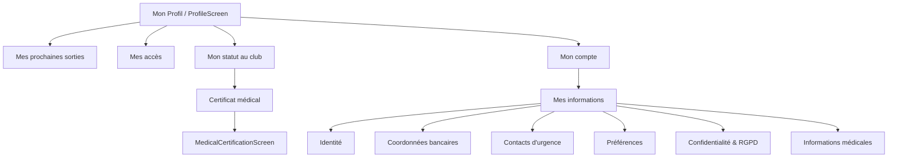

# Mon Espace — Flutter schermen & mockups

**Status:** ontwerpdocument. Geen Flutter-code aanpassen op basis van dit bestand zonder expliciete opdracht.

**Doel:** visueel en functioneel vastleggen welke CalyMob-schermen aangepast of bijgemaakt worden voor de uitbreiding van **Mon Espace / Mon Profil**. Dit document dient als briefing voor latere implementatie.

---

## 1. Overzicht schermen

| Scherm | Type | Actie | Doel |
|---|---|---|---|
| `ProfileScreen` | bestaand | aanpassen | Hub uitbreiden met clubstatus, komende sorties en nieuwe toegang naar Mes informations |
| `MesInformationsScreen` | nieuw | bouwen | Centrale profielhub voor identiteit, bankgegevens, noodcontacten, voorkeuren en RGPD |
| `IdentiteSection` | nieuw onderdeel | bouwen | Naam/email read-only, telefoon, foto, geboortedatum en adres beheren |
| `BancaireSection` | nieuw onderdeel | bouwen | IBAN voor terugbetalingen beheren |
| `EmergencyContactsSection` | nieuw onderdeel | bouwen | Noodcontacten beheren + staff/CA opt-in |
| `PreferencesSection` | nieuw onderdeel | bouwen | Taal, notificaties en zichtbaarheid/Who’s Who voorkeuren bundelen |
| `PrivacyRgpdSection` | nieuw onderdeel | bouwen | Consent-overzicht en delete-acties per datadomein |
| `MedicalInfoSection` | nieuw onderdeel | later bouwen | Vrijwillige medische info + aparte medische opt-in |
| `MedicalCertificationScreen` | bestaand | licht aanpassen | Upload-formaten en copy polish |

---

## 2. Navigatie



---

## 3. `ProfileScreen` — aangepast

### Doel

De huidige `Mon Profil` blijft de snelle hub. Hij toont niet alle details, maar geeft in één oogopslag:

- identiteit + QR
- komende sorties
- toegang tot rolgebonden functies
- clubstatus: cotisation + medisch certificaat
- account-acties

### Wireframe

```text
┌──────────────────────────────────────┐
│ AppBar: Mon Profil                   │
├──────────────────────────────────────┤
│ [avatar] Jan ANDRIESSENS             │
│          Niveau LIFRAS pill          │
│                                      │
│ ┌──────── UserQRCard ──────────────┐ │
│ │ QR + validité cotisation/certif  │ │
│ └──────────────────────────────────┘ │
│                                      │
│                                      │
│ MES ACCÈS                            │
│ ┌──────────────────────────────────┐ │
│ │ Piscine          chevron         │ │
│ │ Finances         chevron         │ │
│ └──────────────────────────────────┘ │
│                                      │
│ MON STATUT AU CLUB                   │
│ ┌──────────────────────────────────┐ │
│ │ Ma cotisation     [Valable]  >   │ │
│ │ Certificat médical [Valide]  >   │ │
│ └──────────────────────────────────┘ │
│                                      │
│ MON COMPTE                           │
│ ┌──────────────────────────────────┐ │
│ │ Mes informations             >   │ │
│ │ Paramètres                   >   │ │
│ │ Déconnexion                      │ │
│ └──────────────────────────────────┘ │
└──────────────────────────────────────┘
```

### States

**Mes prochaines sorties**

- verborgen als er geen komende inschrijvingen zijn
- max. 3 items
- betaalbadge: `Payé`, `Banque`, `À payer`
- tap opent detail van de sortie

**Ma cotisation**

- `À régler`: geen `cotisation_validite`
- `Valable`: geldigheid > 30 dagen
- `Expire bientôt`: geldigheid binnen 30 dagen
- `Expirée`: geldigheid voorbij

**Certificat médical**

- gebruikt bestaande medical certification-status indien beschikbaar
- anders fallback op `certificat_medical_validite`

---

## 4. `MesInformationsScreen` — nieuw

### Doel

Eén centrale plek waar een lid zijn gegevens kan bekijken en beheren. De UI volgt de `who_is_who_screen.dart`-stijl: ocean gradient, bubbles, scrollbare section-cards.

### Wireframe

```text
┌──────────────────────────────────────┐
│ AppBar: Mes informations             │
├──────────────────────────────────────┤
│ [avatar] Jan ANDRIESSENS             │
│          4 · jan@example.com         │
│                                      │
│ ┌─ Identité ───────────────────────┐ │
│ │ Nom, email, niveau               │ │
│ │ Téléphone, date naissance, adres │ │
│ │ [Modifier]                       │ │
│ └──────────────────────────────────┘ │
│                                      │
│ ┌─ Coordonnées bancaires ──────────┐ │
│ │ IBAN masqué                      │ │
│ │ Titulaire                        │ │
│ │ [Modifier] [Supprimer]           │ │
│ └──────────────────────────────────┘ │
│                                      │
│ ┌─ Contacts d'urgence ─────────────┐ │
│ │ Contact 1                        │ │
│ │ Contact 2                        │ │
│ │ [Ajouter]                        │ │
│ │ Toggle partage encadrants/CA     │ │
│ └──────────────────────────────────┘ │
│                                      │
│ ┌─ Préférences ────────────────────┐ │
│ │ Langue · Notifications · Who's Who│ │
│ └──────────────────────────────────┘ │
│                                      │
│ ┌─ Confidentialité & RGPD ─────────┐ │
│ │ Consents photo                   │ │
│ │ Consent urgence                  │ │
│ │ Suppression par domaine          │ │
│ └──────────────────────────────────┘ │
└──────────────────────────────────────┘
```

### Data-indeling

Gevoelige data blijft gesplitst per toegangsmodel:

```text
clubs/{clubId}/members/{userId}
  birth_date
  language_pref
  address_street
  address_postcode
  address_city
  address_country

clubs/{clubId}/members/{userId}/sensitive_info/banking
  iban
  iban_holder_name
  updated_at

clubs/{clubId}/members/{userId}/sensitive_info/emergency
  emergency_contacts[]
  gdpr_share_emergency_with_staff
  gdpr_consent_date_emergency
  updated_at

clubs/{clubId}/members/{userId}/sensitive_info/medical
  medical_medication
  medical_allergies
  medical_blood_group
  medical_notes
  gdpr_share_medical_with_staff
  gdpr_consent_date_medical
  updated_at
```

---

## 5. Sectie — Identité

### Doel

Basisidentiteit tonen, met enkel veilige velden bewerkbaar door het lid.

### Wireframe

```text
┌─ Identité ───────────────────────────┐
│ [avatar]                             │
│ Jan ANDRIESSENS                      │
│ jan@example.com                      │
│ Email modifiable via administrateur  │
│                                      │
│ Niveau LIFRAS        4               │
│ Téléphone            +32 ...     [✎] │
│ Date de naissance    12/03/1980 [✎] │
│ Adresse              Rue ...    [✎] │
│                                      │
│ [Changer la photo]                   │
└──────────────────────────────────────┘
```

### Regels

- naam read-only
- email read-only
- niveau read-only
- telefoon/foto volgens bestaande flow
- geboortedatum en adres nieuw

---

## 6. Sectie — Coordonnées bancaires

### Doel

IBAN tonen en beheren voor terugbetalingen. Als er vandaag al een IBAN op het member-document staat (`iban` of `ibans`), tonen we die meteen in deze sectie. De latere `sensitive_info/banking`-doc wordt de nieuwe opslagplek, maar de eerste UI mag bestaande data al lezen zodat het scherm niet leeg lijkt voor leden die al bankgegevens hebben.

Deze data mag niet leesbaar worden via emergency/medical opt-ins.

### Wireframe

```text
┌─ Coordonnées bancaires ──────────────┐
│ Pour remboursements du club.         │
│                                      │
│ IBAN                                 │
│ BE** **** **** 1234              [✎] │
│                                      │
│ Titulaire                            │
│ Jan ANDRIESSENS                  [✎] │
│                                      │
│ [Supprimer mes coordonnées bancaires]│
└──────────────────────────────────────┘
```

### Validatie

- bestaande `iban` / eerste waarde uit `ibans` tonen als startwaarde
- Belgische IBAN-validatie: formaat + checksum
- gemaskeerde weergave na opslaan
- volledige waarde alleen in edit-state tonen
- bij opslaan schrijft de nieuwe flow naar `sensitive_info/banking`; migratie/cleanup van oude velden is een aparte stap

---

## 7. Sectie — Contacts d'urgence

### Doel

Maximaal 3 noodcontacten beheren en expliciet toestemming geven dat encadrants/CA ze mogen lezen.

### Wireframe

```text
┌─ Contacts d'urgence ─────────────────┐
│ Pour être aidé rapidement en cas de  │
│ problème pendant une activité.       │
│                                      │
│ 1. Marie ANDRIESSENS                 │
│    Épouse · +32 ...              [✎] │
│ 2. Paul ANDRIESSENS                  │
│    Frère · +32 ...               [✎] │
│                                      │
│ [Ajouter un contact]                 │
│                                      │
│ [toggle] Partager avec encadrants    │
│          et CA si nécessaire         │
│ Consentement: 19/05/2026             │
│                                      │
│ [Supprimer mes contacts d'urgence]   │
└──────────────────────────────────────┘
```

### Contact editor

```text
┌─ Contact d'urgence ──────────────────┐
│ Nom                                  │
│ [____________________________]       │
│ Relation                             │
│ [Épouse / Parent / Ami / Autre]      │
│ Téléphone                            │
│ [____________________________]       │
│ Email                                │
│ [____________________________]       │
│ Priorité                             │
│ [-] 1 [+]                            │
│                                      │
│ [Annuler]                  [Sauver]  │
└──────────────────────────────────────┘
```

---

## 8. Sectie — Préférences

### Doel

Voorkeuren groeperen zonder de bestaande SettingsScreen te dupliceren.

### Wireframe

```text
┌─ Préférences ────────────────────────┐
│ Notifications                        │
│ Activées                         >   │
│                                      │
│ Who's Who                            │
│ Email visible        [toggle]        │
│ Téléphone visible    [toggle: on]    │
└──────────────────────────────────────┘
```

### Regels

- taal niet tonen: de app blijft voor iedereen in het Frans
- notificaties mogen linken naar bestaande instellingen
- Who’s Who gebruikt bestaande share-fields
- telefoon zichtbaar in Who’s Who staat standaard op ja, maar het lid mag dit zelf uitzetten

---

## 9. Sectie — Confidentialité & RGPD

### Doel

Eén overzicht van toestemmingen en verwijderacties per datadomein.

### Wireframe

```text
┌─ Confidentialité & RGPD ─────────────┐
│ Photos                               │
│ Usage interne         ✓ 12/01/2026   │
│ Usage externe         —              │
│                                      │
│ Contacts d'urgence                   │
│ Partage staff/CA      ✓ 19/05/2026   │
│                                      │
│ Coordonnées bancaires                │
│ Privées, non partagées               │
│                                      │
│ Actions                              │
│ [Supprimer coordonnées bancaires]    │
│ [Supprimer contacts d'urgence]       │
└──────────────────────────────────────┘
```

### Regels

- geen globale bulk-delete zonder confirm-flow
- delete per domein
- alleen minimale consent/audit-metadata bewaren als daar een duidelijke compliance-grond voor is

---

## 10. Sectie — Informations médicales

### Doel

Vrijwillige medische gegevens voor noodgevallen. Apart van het medisch certificaat.

### Wireframe

```text
┌─ Informations médicales ─────────────┐
│ Cette section est facultative. Ces   │
│ données ne sont visibles que par     │
│ vous, sauf partage activé ci-dessous.│
│                                      │
│ Médication                           │
│ [____________________________]       │
│ Allergies                            │
│ [____________________________]       │
│ Groupe sanguin                       │
│ [A+ v]                               │
│ Notes utiles                         │
│ [____________________________]       │
│                                      │
│ [toggle] Partager avec encadrants    │
│          et CA en cas d'urgence      │
│ Consentement: 19/05/2026             │
│                                      │
│ [Supprimer mes informations médicales]│
└──────────────────────────────────────┘
```

### Belangrijk onderscheid

- **Certificat médical** = document/validatie/status
- **Informations médicales** = vrijwillige vrije info voor noodgevallen
- medische opt-in is onafhankelijk van noodcontact-opt-in

---

## 11. `MedicalCertificationScreen` — lichte aanpassing

### Doel

Bestaande flow behouden, maar upload gebruiksvriendelijker maken.

### Wireframe uploadblok

```text
┌─ Télécharger un certificat ──────────┐
│ [Scanner le document]                │
│ Scan automatique recommandé          │
│                                      │
│ [Importer un fichier]                │
│ Photo · PDF · Image — max 10 Mo      │
└──────────────────────────────────────┘
```

### Wijzigingen

- toegestane extensies: `jpg`, `jpeg`, `png`, `pdf`, `heic`, `heif`, `webp`
- niet-PDF door image-compress/conversie naar JPG
- PDF blijft PDF

---

## 12. Mobile responsive aandachtspunten

- lange namen en emails mogen niet overlappen
- statusbadges blijven compact
- section-cards zijn full-width, geen card-in-card
- icon-buttons waar mogelijk, tekstbuttons alleen voor duidelijke acties
- delete-acties altijd met confirm-dialog
- gevoelige info niet direct tonen in collapsed cards, vooral IBAN masken

---

## 13. Implementatievolgorde later

1. `ProfileScreen` statuslaag + mockupsecties
2. `MesInformationsScreen` zonder Firestore writes, met read-only placeholders
3. `banking` en `emergency` models/services + Firestore rules
4. edit-flows voor identiteit, IBAN en noodcontacten
5. RGPD/delete-acties
6. medische info-sectie + aparte rules
7. upload-polish in `MedicalCertificationScreen`
