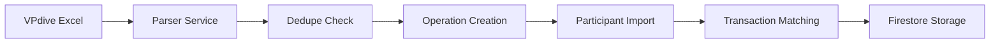
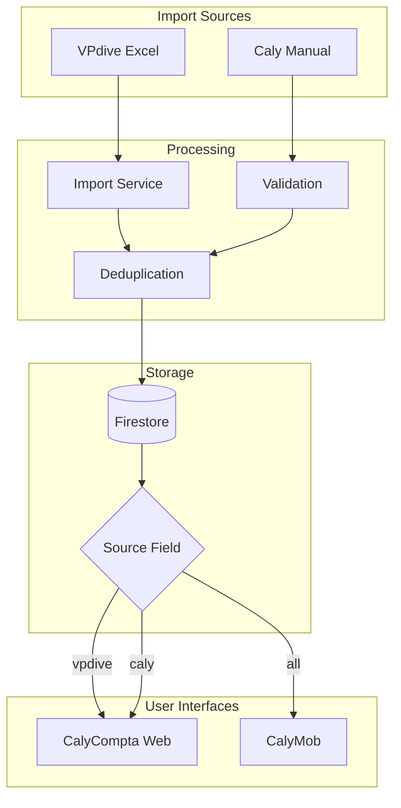

# 📚 Complete VPDive → Caly Migration Guide
## Dual-System Strategy for Events & Subscriptions via CalyMob

**Version**: 1.0
**Date**: November 2025
**Timeline**: 5-6 weeks
**Goal**: Enable all event inscriptions and communication via CalyMob while maintaining VPdive compatibility

---

## 📋 Table of Contents

1. [Executive Summary](#executive-summary)
2. [Current State Analysis](#current-state-analysis)
3. [Target Architecture](#target-architecture)
4. [Implementation Phases](#implementation-phases)
5. [Technical Implementation](#technical-implementation)
6. [Testing & Deployment](#testing-deployment)
7. [Risk Management](#risk-management)
8. [Success Metrics](#success-metrics)

---

## 🎯 Executive Summary {#executive-summary}

### Project Overview
Implement a dual-system migration strategy allowing VPdive event imports to coexist with native Caly events, ultimately moving all inscriptions to CalyMob mobile app.

### Key Discovery
✅ **CalyMob already exists** at `/Users/jan/Documents/GitHub/CalyMob` with basic event functionality, reducing implementation from 16-20 weeks to **5-6 weeks**.

### Budget Impact
- **Original Estimate**: €12,000-15,000 (16-20 weeks)
- **Revised Estimate**: €3,500-4,500 (5-6 weeks)
- **Savings**: €8,500-10,500 (70% reduction)

### Critical Success Factors
1. Source differentiation (VPdive vs Caly)
2. Enhanced registration form in CalyMob
3. Communication system (email/WhatsApp/push)
4. User training and support

---

## 🔍 Current State Analysis {#current-state-analysis}

### Existing Infrastructure

#### CalyCompta Web Application
```
✅ Functional Components:
├── VPDive Excel import (.xls parsing)
├── Duplicate detection (source hashing)
├── Operations collection (multi-type events)
├── Transaction auto-matching
├── Web UI for event management
└── Firestore backend

⚠️ Missing Components:
├── Source field tracking
├── Migration tools
├── Communication system
└── API endpoints for mobile
```

#### CalyMob Mobile Application
```
✅ Existing Features:
├── Event listing view
├── Event detail screen
├── Basic registration (confirmation dialog)
├── Unregister functionality
├── Real-time Firestore sync
└── Provider state management

❌ Required Enhancements:
├── Source differentiation UI
├── Full registration form
├── Payment integration
├── Push notifications
├── WhatsApp support
└── Offline capabilities
```

### VPdive Import Flow


### Database Schema

#### Current Operation Model
```typescript
interface Operation {
  id: string;
  type: 'evenement' | 'cotisation' | 'caution' | 'vente' | 'subvention';
  titre: string;
  montant_prevu: number;
  statut: 'brouillon' | 'ouvert' | 'ferme' | 'annule';

  // Event-specific
  date_debut?: Date;
  date_fin?: Date;
  lieu?: string;
  prix_membre?: number;
  vp_dive_source_hash?: string;  // ✅ Deduplication already exists
}
```

#### Required Schema Additions
```typescript
interface OperationMigration {
  // New fields needed
  source: 'vpdive' | 'caly' | 'manual';  // Data origin
  vpdiveId?: string;                      // External reference
  lastSyncedAt?: Date;                    // Last sync timestamp
  migratedAt?: Date;                      // Conversion timestamp
  isEditable: boolean;                    // Lock VPdive events
  syncStatus?: 'pending' | 'synced' | 'error' | 'migrated';
}
```

---

## 🏗️ Target Architecture {#target-architecture}

### System Overview
```
┌─────────────────────────────────────────────────────────┐
│                    User Interfaces                       │
├──────────────────────┬───────────────────────────────────┤
│   CalyCompta Web     │        CalyMob Mobile            │
│  • Admin functions   │  • Event browsing                │
│  • VPdive imports    │  • Registration forms            │
│  • Migration tools   │  • Payment instructions          │
│                      │  • Push notifications            │
└──────────────────────┴───────────────────────────────────┘
                       │
┌──────────────────────▼───────────────────────────────────┐
│                  Firestore Database                      │
│  • /operations (source-aware)                            │
│  • /operation_participants                               │
│  • /migration_audit                                      │
└──────────────────────────────────────────────────────────┘
                       │
┌──────────────────────▼───────────────────────────────────┐
│                 External Services                        │
├──────────────┬────────────────┬──────────────────────────┤
│   VPdive     │    Email       │     WhatsApp             │
│   Imports    │    Service     │     Business API         │
└──────────────┴────────────────┴──────────────────────────┘
```

### Data Flow During Migration


---

## 📅 Implementation Phases {#implementation-phases}

### Timeline Overview
```
Week 1  ████████░░░░░░░░░░░░  Database & UI Updates
Week 2  ░░░░░░░░████████░░░░  Enhanced Registration
Week 3  ░░░░░░░░░░░░░░░░████  Communication Setup
Week 4  ░░░░░░░░░░░░░░░░████  Communication Complete
Week 5  ░░░░░░░░░░░░░░░░░░░░  Testing & Polish
Week 6  ░░░░░░░░░░░░░░░░░░░░  Deployment & Launch
```

### Phase 1: Database & Source Differentiation (Week 1)

#### Day 1-2: Schema Updates
- [ ] Add source fields to Operation type
- [ ] Create migration script for existing data
- [ ] Update Firestore security rules
- [ ] Deploy schema changes

#### Day 3-4: CalyMob UI Updates
- [ ] Implement SourceBadge widget
- [ ] Add source filtering
- [ ] Update operation cards
- [ ] Visual differentiation (colors/icons)

#### Day 5: CalyCompta Updates
- [ ] Add source field to import process
- [ ] Implement migration button for admins
- [ ] Update operation list UI
- [ ] Test VPdive imports with source tracking

### Phase 2: Enhanced Registration (Week 2)

#### Day 6-7: Registration Form
- [ ] Create full registration form screen
- [ ] Add all required fields (emergency contact, LIFRAS, etc.)
- [ ] Implement form validation
- [ ] Connect to Firestore

#### Day 8-9: Success Flow
- [ ] Build registration success screen
- [ ] Add payment instructions
- [ ] Create "My Registrations" view
- [ ] Implement registration management

#### Day 10: Integration
- [ ] Update navigation flow
- [ ] Test end-to-end registration
- [ ] Fix UI/UX issues
- [ ] Verify data persistence

### Phase 3-4: Communication System (Week 3-4)

#### Week 3: Push Notifications
- [ ] Configure Firebase Cloud Messaging
- [ ] Implement notification service
- [ ] Setup local notifications
- [ ] Create notification preferences

#### Week 4: Email & WhatsApp
- [ ] Setup email templates
- [ ] Configure email service
- [ ] WhatsApp Business API integration
- [ ] Test all communication channels

### Phase 5: Testing & Polish (Week 5)

#### Testing Checklist
- [ ] VPdive event display
- [ ] Caly event creation
- [ ] Registration flow
- [ ] Payment instructions
- [ ] Notifications delivery
- [ ] Offline functionality
- [ ] Performance testing

### Phase 6: Deployment (Week 6)

#### Deployment Steps
- [ ] Beta release to TestFlight/Play Console
- [ ] User acceptance testing (5-10 users)
- [ ] Bug fixes from beta feedback
- [ ] Production deployment
- [ ] Monitor metrics

---

## 💻 Technical Implementation {#technical-implementation}

### 1. Database Schema Updates

#### CalyCompta: Update Types
```typescript
// src/types/index.ts
export interface Operation {
  // ... existing fields ...

  // Migration support
  source?: 'vpdive' | 'caly' | 'manual';
  vpdiveId?: string;
  isEditable?: boolean;
  lastSyncedAt?: Date;
  migratedAt?: Date;
  syncStatus?: 'pending' | 'synced' | 'error' | 'migrated';
  importBatch?: string;
  importedBy?: string;
  importedAt?: Date;
}
```

#### Firestore Migration Script
```typescript
// scripts/migrate-add-source-fields.ts
import { db } from '../src/lib/firebase-admin';
import { collection, getDocs, updateDoc, doc } from 'firebase/firestore';

async function migrateOperations() {
  const operationsRef = collection(db, 'clubs', 'calypso', 'operations');
  const snapshot = await getDocs(operationsRef);

  const batch = db.batch();

  snapshot.forEach((docSnap) => {
    const data = docSnap.data();
    const updates: any = {
      source: data.vp_dive_source_hash ? 'vpdive' : 'caly',
      isEditable: !data.vp_dive_source_hash,
      syncStatus: 'synced'
    };

    batch.update(doc(db, 'clubs', 'calypso', 'operations', docSnap.id), updates);
  });

  await batch.commit();
  console.log(`✅ Migrated ${snapshot.size} operations`);
}
```

### 2. CalyMob Source Differentiation

#### Source Badge Component
```dart
// lib/widgets/source_badge.dart
import 'package:flutter/material.dart';
import '../models/operation.dart';

class SourceBadge extends StatelessWidget {
  final Operation operation;
  final bool compact;

  const SourceBadge({
    Key? key,
    required this.operation,
    this.compact = false,
  }) : super(key: key);

  @override
  Widget build(BuildContext context) {
    if (operation.source == null) return SizedBox.shrink();

    final config = _getConfig();

    if (compact) {
      return Container(
        width: 8,
        height: 8,
        decoration: BoxDecoration(
          color: config.color,
          shape: BoxShape.circle,
        ),
      );
    }

    return Container(
      padding: EdgeInsets.symmetric(horizontal: 8, vertical: 4),
      decoration: BoxDecoration(
        color: config.color.withOpacity(0.15),
        borderRadius: BorderRadius.circular(12),
        border: Border.all(
          color: config.color.withOpacity(0.3),
          width: 1,
        ),
      ),
      child: Row(
        mainAxisSize: MainAxisSize.min,
        children: [
          Icon(config.icon, size: 14, color: config.color),
          SizedBox(width: 4),
          Text(
            config.label,
            style: TextStyle(
              fontSize: 11,
              fontWeight: FontWeight.w600,
              color: config.color,
            ),
          ),
          if (!operation.isEditable) ...[
            SizedBox(width: 4),
            Icon(Icons.lock_outline, size: 12, color: Colors.grey),
          ],
        ],
      ),
    );
  }

  _BadgeConfig _getConfig() {
    switch (operation.source) {
      case 'vpdive':
        return _BadgeConfig(
          label: 'VPDive',
          icon: Icons.download_outlined,
          color: Color(0xFFFB923C), // Orange
        );
      case 'caly':
        return _BadgeConfig(
          label: 'Caly',
          icon: Icons.check_circle_outline,
          color: Color(0xFF10B981), // Green
        );
      default:
        return _BadgeConfig(
          label: 'Manuel',
          icon: Icons.edit_outlined,
          color: Colors.blue,
        );
    }
  }
}

class _BadgeConfig {
  final String label;
  final IconData icon;
  final Color color;

  _BadgeConfig({
    required this.label,
    required this.icon,
    required this.color,
  });
}
```

#### Updated Operation Model
```dart
// lib/models/operation.dart
class Operation {
  // ... existing fields ...

  // Migration support
  final String? source;
  final String? vpdiveId;
  final bool isEditable;
  final DateTime? lastSyncedAt;
  final DateTime? migratedAt;
  final String? syncStatus;

  Operation({
    // ... existing parameters ...
    this.source,
    this.vpdiveId,
    this.isEditable = true,
    this.lastSyncedAt,
    this.migratedAt,
    this.syncStatus,
  });

  factory Operation.fromFirestore(DocumentSnapshot doc) {
    final data = doc.data() as Map<String, dynamic>;

    return Operation(
      // ... existing mapping ...
      source: data['source'],
      vpdiveId: data['vpdiveId'],
      isEditable: data['isEditable'] ?? true,
      lastSyncedAt: (data['lastSyncedAt'] as Timestamp?)?.toDate(),
      migratedAt: (data['migratedAt'] as Timestamp?)?.toDate(),
      syncStatus: data['syncStatus'],
    );
  }

  // Helper getters
  bool get isVPDiveEvent => source == 'vpdive';
  bool get isCalyEvent => source == 'caly';
  bool get canEdit => isEditable && source != 'vpdive';
}
```

### 3. Enhanced Registration Form

#### Complete Registration Screen
```dart
// lib/screens/operations/registration_form_screen.dart
import 'package:flutter/material.dart';
import 'package:cloud_firestore/cloud_firestore.dart';
import 'package:provider/provider.dart';

class RegistrationFormScreen extends StatefulWidget {
  final Operation operation;

  const RegistrationFormScreen({
    Key? key,
    required this.operation,
  }) : super(key: key);

  @override
  _RegistrationFormScreenState createState() =>
      _RegistrationFormScreenState();
}

class _RegistrationFormScreenState extends State<RegistrationFormScreen> {
  final _formKey = GlobalKey<FormState>();

  // Controllers for all fields
  final _nameController = TextEditingController();
  final _emailController = TextEditingController();
  final _phoneController = TextEditingController();
  final _lifrasController = TextEditingController();
  final _emergencyNameController = TextEditingController();
  final _emergencyPhoneController = TextEditingController();
  final _dietaryController = TextEditingController();
  final _commentsController = TextEditingController();

  bool _acceptTerms = false;
  bool _isSubmitting = false;

  @override
  Widget build(BuildContext context) {
    return Scaffold(
      appBar: AppBar(
        title: Text('Inscription'),
        backgroundColor: Theme.of(context).primaryColor,
      ),
      body: Form(
        key: _formKey,
        child: ListView(
          padding: EdgeInsets.all(16),
          children: [
            // Event info card with source badge
            _buildEventInfoCard(),

            SizedBox(height: 24),

            // Personal information section
            _buildSectionTitle('Informations personnelles', Icons.person),
            _buildTextField(
              controller: _nameController,
              label: 'Nom complet *',
              validator: _requiredValidator,
              icon: Icons.person_outline,
            ),
            _buildTextField(
              controller: _emailController,
              label: 'Email *',
              validator: _emailValidator,
              keyboardType: TextInputType.emailAddress,
              icon: Icons.email_outlined,
            ),
            _buildTextField(
              controller: _phoneController,
              label: 'Téléphone *',
              validator: _phoneValidator,
              keyboardType: TextInputType.phone,
              icon: Icons.phone_outlined,
            ),
            _buildTextField(
              controller: _lifrasController,
              label: 'Numéro LIFRAS',
              icon: Icons.badge_outlined,
              helperText: 'Ex: 54791',
            ),

            SizedBox(height: 24),

            // Emergency contact section
            _buildSectionTitle('Contact d\'urgence', Icons.emergency),
            _buildTextField(
              controller: _emergencyNameController,
              label: 'Nom du contact',
              icon: Icons.contact_phone_outlined,
            ),
            _buildTextField(
              controller: _emergencyPhoneController,
              label: 'Téléphone du contact',
              keyboardType: TextInputType.phone,
              icon: Icons.phone_in_talk_outlined,
            ),

            SizedBox(height: 24),

            // Additional information
            _buildSectionTitle('Informations complémentaires', Icons.info),
            _buildTextField(
              controller: _dietaryController,
              label: 'Régime alimentaire / Allergies',
              maxLines: 2,
              icon: Icons.restaurant_outlined,
            ),
            _buildTextField(
              controller: _commentsController,
              label: 'Commentaires',
              maxLines: 3,
              icon: Icons.comment_outlined,
            ),

            SizedBox(height: 24),

            // Terms acceptance
            _buildTermsCard(),

            SizedBox(height: 24),

            // Submit button
            _buildSubmitButton(),

            SizedBox(height: 32),
          ],
        ),
      ),
    );
  }

  Widget _buildEventInfoCard() {
    return Card(
      elevation: 2,
      child: Padding(
        padding: EdgeInsets.all(16),
        child: Column(
          crossAxisAlignment: CrossAxisAlignment.start,
          children: [
            Row(
              children: [
                Expanded(
                  child: Text(
                    widget.operation.titre,
                    style: TextStyle(
                      fontSize: 18,
                      fontWeight: FontWeight.bold,
                    ),
                  ),
                ),
                SourceBadge(operation: widget.operation),
              ],
            ),
            SizedBox(height: 12),
            if (widget.operation.dateDebut != null)
              _buildInfoRow(
                Icons.calendar_today,
                DateFormatter.formatLong(widget.operation.dateDebut!),
              ),
            if (widget.operation.lieu != null)
              _buildInfoRow(Icons.location_on, widget.operation.lieu!),
            _buildInfoRow(
              Icons.euro,
              '${widget.operation.prixMembre?.toStringAsFixed(2) ?? '0'}€',
            ),
          ],
        ),
      ),
    );
  }

  Widget _buildTermsCard() {
    return Card(
      color: Colors.blue.shade50,
      child: CheckboxListTile(
        title: Text(
          'J\'accepte les conditions',
          style: TextStyle(fontWeight: FontWeight.w600),
        ),
        subtitle: Text(
          'Je confirme mon inscription et m\'engage à régler '
          '${widget.operation.prixMembre?.toStringAsFixed(2) ?? '0'}€',
          style: TextStyle(fontSize: 12),
        ),
        value: _acceptTerms,
        onChanged: (value) {
          setState(() => _acceptTerms = value ?? false);
        },
        activeColor: Colors.blue,
      ),
    );
  }

  Widget _buildSubmitButton() {
    return ElevatedButton(
      onPressed: _acceptTerms && !_isSubmitting
          ? _submitRegistration
          : null,
      style: ElevatedButton.styleFrom(
        backgroundColor: Colors.green,
        minimumSize: Size(double.infinity, 50),
        shape: RoundedRectangleBorder(
          borderRadius: BorderRadius.circular(12),
        ),
      ),
      child: _isSubmitting
          ? CircularProgressIndicator(color: Colors.white)
          : Row(
              mainAxisAlignment: MainAxisAlignment.center,
              children: [
                Icon(Icons.check_circle, color: Colors.white),
                SizedBox(width: 8),
                Text(
                  'Confirmer l\'inscription',
                  style: TextStyle(
                    fontSize: 16,
                    fontWeight: FontWeight.bold,
                    color: Colors.white,
                  ),
                ),
              ],
            ),
    );
  }

  Future<void> _submitRegistration() async {
    if (!_formKey.currentState!.validate()) return;

    setState(() => _isSubmitting = true);

    try {
      final auth = context.read<AuthProvider>();

      // Create participant document
      final participantData = {
        'operation_id': widget.operation.id,
        'operation_titre': widget.operation.titre,
        'operation_type': 'evenement',
        'membre_nom': _nameController.text,
        'email': _emailController.text,
        'telephone': _phoneController.text,
        'numero_licence': _lifrasController.text.isEmpty
            ? null : _lifrasController.text,
        'contact_urgence_nom': _emergencyNameController.text.isEmpty
            ? null : _emergencyNameController.text,
        'contact_urgence_tel': _emergencyPhoneController.text.isEmpty
            ? null : _emergencyPhoneController.text,
        'regime_alimentaire': _dietaryController.text.isEmpty
            ? null : _dietaryController.text,
        'commentaires': _commentsController.text.isEmpty
            ? null : _commentsController.text,
        'prix': widget.operation.prixMembre ?? 0,
        'paye': false,
        'source': 'caly_mobile',
        'registration_method': 'mobile',
        'date_inscription': FieldValue.serverTimestamp(),
        'club_id': 'calypso',
        'fiscal_year_id': null, // Add if needed
        'created_at': FieldValue.serverTimestamp(),
        'updated_at': FieldValue.serverTimestamp(),
      };

      // Save to Firestore
      await FirebaseFirestore.instance
          .collection('clubs')
          .doc('calypso')
          .collection('operation_participants')
          .add(participantData);

      // Send confirmation email/notification
      await _sendConfirmation();

      if (mounted) {
        // Navigate to success screen
        Navigator.pushReplacement(
          context,
          MaterialPageRoute(
            builder: (context) => RegistrationSuccessScreen(
              operation: widget.operation,
              participantName: _nameController.text,
            ),
          ),
        );
      }
    } catch (e) {
      if (mounted) {
        ScaffoldMessenger.of(context).showSnackBar(
          SnackBar(
            content: Text('Erreur: ${e.toString()}'),
            backgroundColor: Colors.red,
          ),
        );
      }
    } finally {
      if (mounted) {
        setState(() => _isSubmitting = false);
      }
    }
  }

  Future<void> _sendConfirmation() async {
    // Call Firebase Functions to send email/WhatsApp
    try {
      final functions = FirebaseFunctions.instance;
      final callable = functions.httpsCallable('sendEventNotification');

      await callable.call({
        'type': 'inscription_confirmed',
        'eventTitle': widget.operation.titre,
        'userEmail': _emailController.text,
        'userName': _nameController.text,
        'eventDate': widget.operation.dateDebut?.toString(),
        'eventLocation': widget.operation.lieu,
        'price': widget.operation.prixMembre,
      });
    } catch (e) {
      print('Error sending confirmation: $e');
    }
  }

  String? _requiredValidator(String? value) {
    if (value == null || value.isEmpty) {
      return 'Ce champ est requis';
    }
    return null;
  }

  String? _emailValidator(String? value) {
    if (value == null || value.isEmpty) {
      return 'Email requis';
    }
    if (!RegExp(r'^[\w-\.]+@([\w-]+\.)+[\w-]{2,4}$').hasMatch(value)) {
      return 'Email invalide';
    }
    return null;
  }

  String? _phoneValidator(String? value) {
    if (value == null || value.isEmpty) {
      return 'Téléphone requis';
    }
    // Belgian phone number validation
    if (!RegExp(r'^(\+32|0)[1-9]\d{7,8}$').hasMatch(value.replaceAll(' ', ''))) {
      return 'Numéro invalide (format belge)';
    }
    return null;
  }

  // ... Helper methods for UI components
}
```

### 4. Communication System

#### Push Notification Service
```dart
// lib/services/notification_service.dart
import 'package:firebase_messaging/firebase_messaging.dart';
import 'package:flutter_local_notifications/flutter_local_notifications.dart';

class NotificationService {
  static final _messaging = FirebaseMessaging.instance;
  static final _localNotifications = FlutterLocalNotificationsPlugin();

  static Future<void> initialize() async {
    // Request permissions
    final settings = await _messaging.requestPermission(
      alert: true,
      badge: true,
      sound: true,
    );

    if (settings.authorizationStatus == AuthorizationStatus.authorized) {
      print('✅ Push notifications authorized');

      // Get and save FCM token
      final token = await _messaging.getToken();
      await _saveToken(token);

      // Listen for token refresh
      _messaging.onTokenRefresh.listen(_saveToken);

      // Configure local notifications
      await _configureLocalNotifications();

      // Handle messages
      FirebaseMessaging.onMessage.listen(_handleForegroundMessage);
      FirebaseMessaging.onBackgroundMessage(_handleBackgroundMessage);
    }
  }

  static Future<void> _saveToken(String? token) async {
    if (token == null) return;

    final user = FirebaseAuth.instance.currentUser;
    if (user != null) {
      await FirebaseFirestore.instance
          .collection('users')
          .doc(user.uid)
          .update({
        'fcm_token': token,
        'fcm_token_updated': FieldValue.serverTimestamp(),
      });
    }
  }

  static Future<void> _configureLocalNotifications() async {
    const androidSettings = AndroidInitializationSettings('@mipmap/ic_launcher');
    const iosSettings = DarwinInitializationSettings();

    await _localNotifications.initialize(
      InitializationSettings(
        android: androidSettings,
        iOS: iosSettings,
      ),
    );
  }

  static void _handleForegroundMessage(RemoteMessage message) {
    // Show local notification
    _showLocalNotification(
      title: message.notification?.title ?? 'CalyMob',
      body: message.notification?.body ?? '',
      payload: message.data,
    );
  }

  static Future<void> _handleBackgroundMessage(RemoteMessage message) async {
    print('Background message: ${message.messageId}');
  }

  static Future<void> _showLocalNotification({
    required String title,
    required String body,
    Map<String, dynamic>? payload,
  }) async {
    const details = NotificationDetails(
      android: AndroidNotificationDetails(
        'calymob_events',
        'Event Notifications',
        importance: Importance.high,
        priority: Priority.high,
      ),
      iOS: DarwinNotificationDetails(
        presentAlert: true,
        presentBadge: true,
        presentSound: true,
      ),
    );

    await _localNotifications.show(
      DateTime.now().millisecondsSinceEpoch ~/ 1000,
      title,
      body,
      details,
    );
  }
}
```

#### Backend Email/WhatsApp Function
```typescript
// functions/src/notifications.ts
import * as functions from 'firebase-functions';
import * as nodemailer from 'nodemailer';

const mailTransport = nodemailer.createTransport({
  service: 'gmail',
  auth: {
    user: functions.config().gmail.email,
    pass: functions.config().gmail.password,
  },
});

export const sendEventNotification = functions.https.onCall(
  async (data, context) => {
    const { type, eventTitle, userEmail, userName, eventDate,
            eventLocation, price } = data;

    const emailTemplates = {
      inscription_confirmed: {
        subject: `Inscription confirmée: ${eventTitle}`,
        html: `
          <!DOCTYPE html>
          <html>
          <head>
            <style>
              body { font-family: Arial, sans-serif; }
              .container { max-width: 600px; margin: 0 auto; }
              .header { background: #1976D2; color: white; padding: 20px; }
              .content { padding: 20px; }
              .info-box { background: #f5f5f5; padding: 15px;
                          border-radius: 8px; margin: 10px 0; }
              .payment-box { background: #fff3cd; padding: 15px;
                            border: 1px solid #ffc107; border-radius: 8px; }
              .footer { text-align: center; padding: 20px;
                       color: #666; font-size: 12px; }
            </style>
          </head>
          <body>
            <div class="container">
              <div class="header">
                <h2>Inscription confirmée!</h2>
              </div>
              <div class="content">
                <p>Bonjour ${userName},</p>
                <p>Votre inscription à <strong>${eventTitle}</strong>
                   a bien été enregistrée.</p>

                <div class="info-box">
                  <h3>Détails de l'événement:</h3>
                  <ul>
                    <li><strong>Date:</strong> ${eventDate}</li>
                    <li><strong>Lieu:</strong> ${eventLocation}</li>
                    <li><strong>Prix:</strong> €${price}</li>
                  </ul>
                </div>

                <div class="payment-box">
                  <h3>Instructions de paiement:</h3>
                  <p>Merci d'effectuer le virement sur le compte suivant:</p>
                  <ul>
                    <li><strong>IBAN:</strong> BE12 3456 7890 1234</li>
                    <li><strong>BIC:</strong> GEBABEBB</li>
                    <li><strong>Communication:</strong> ${eventTitle} - ${userName}</li>
                    <li><strong>Montant:</strong> €${price}</li>
                  </ul>
                </div>

                <p>Si vous avez des questions, n'hésitez pas à nous contacter.</p>

                <p>Cordialement,<br>L'équipe Calypso</p>
              </div>
              <div class="footer">
                <p>Calypso Diving Club - Avenue des Sports 12, 1000 Bruxelles</p>
                <p>info@calypso-diving.be | +32 2 123 45 67</p>
              </div>
            </div>
          </body>
          </html>
        `,
      },
    };

    const template = emailTemplates[type];
    if (template) {
      await mailTransport.sendMail({
        from: 'CalyMob <noreply@calypso-diving.be>',
        to: userEmail,
        subject: template.subject,
        html: template.html,
      });
    }

    // Optional: Send WhatsApp via Twilio or similar
    // await sendWhatsApp({...});

    return { success: true };
  }
);
```

### 5. Migration Tools

#### Admin Migration Dashboard (CalyCompta)
```typescript
// src/components/admin/MigrationDashboard.tsx
import React, { useState, useEffect } from 'react';
import {
  collection, query, where, getDocs, updateDoc, doc
} from 'firebase/firestore';
import { db } from '@/lib/firebase';

export function MigrationDashboard() {
  const [stats, setStats] = useState({
    totalEvents: 0,
    vpdiveEvents: 0,
    calyEvents: 0,
    pendingMigration: 0,
    migrationProgress: 0,
  });

  const [selectedEvents, setSelectedEvents] = useState<string[]>([]);

  useEffect(() => {
    loadStats();
  }, []);

  const loadStats = async () => {
    const opsRef = collection(db, 'clubs', 'calypso', 'operations');
    const snapshot = await getDocs(query(opsRef, where('type', '==', 'evenement')));

    let vpdive = 0, caly = 0;

    snapshot.forEach(doc => {
      const data = doc.data();
      if (data.source === 'vpdive') vpdive++;
      else if (data.source === 'caly') caly++;
    });

    setStats({
      totalEvents: snapshot.size,
      vpdiveEvents: vpdive,
      calyEvents: caly,
      pendingMigration: vpdive,
      migrationProgress: (caly / snapshot.size) * 100,
    });
  };

  const migrateSelected = async () => {
    const batch = [];

    for (const eventId of selectedEvents) {
      batch.push(
        updateDoc(doc(db, 'clubs', 'calypso', 'operations', eventId), {
          source: 'caly',
          isEditable: true,
          migratedAt: new Date(),
          syncStatus: 'migrated',
        })
      );
    }

    await Promise.all(batch);
    await loadStats();
    setSelectedEvents([]);
  };

  return (
    <div className="p-6 max-w-7xl mx-auto">
      <h1 className="text-2xl font-bold mb-6">
        Migration Dashboard: VPDive → Caly
      </h1>

      {/* Stats Grid */}
      <div className="grid grid-cols-4 gap-4 mb-8">
        <StatCard
          title="Total Events"
          value={stats.totalEvents}
          color="blue"
        />
        <StatCard
          title="VPDive Events"
          value={stats.vpdiveEvents}
          color="orange"
          subtitle="To migrate"
        />
        <StatCard
          title="Caly Native"
          value={stats.calyEvents}
          color="green"
          subtitle="Migrated"
        />
        <StatCard
          title="Progress"
          value={`${stats.migrationProgress.toFixed(1)}%`}
          color="purple"
        />
      </div>

      {/* Progress Bar */}
      <div className="bg-white rounded-lg p-6 mb-8 shadow">
        <h2 className="text-lg font-semibold mb-4">Migration Progress</h2>
        <div className="w-full bg-gray-200 rounded-full h-6">
          <div
            className="bg-gradient-to-r from-orange-500 to-green-500 h-6 rounded-full transition-all duration-500 flex items-center justify-center text-white text-sm font-medium"
            style={{ width: `${stats.migrationProgress}%` }}
          >
            {stats.migrationProgress > 10 && `${stats.migrationProgress.toFixed(1)}%`}
          </div>
        </div>
        <p className="text-sm text-gray-600 mt-2">
          {stats.calyEvents} of {stats.totalEvents} events migrated
        </p>
      </div>

      {/* Migration Actions */}
      <div className="bg-white rounded-lg p-6 shadow">
        <div className="flex justify-between items-center mb-4">
          <h2 className="text-lg font-semibold">Migration Actions</h2>
          <button
            onClick={migrateSelected}
            disabled={selectedEvents.length === 0}
            className="px-4 py-2 bg-purple-600 text-white rounded-lg hover:bg-purple-700 disabled:opacity-50 disabled:cursor-not-allowed"
          >
            Migrate Selected ({selectedEvents.length})
          </button>
        </div>

        <div className="grid gap-2">
          <button
            onClick={() => migrateAllVPDive()}
            className="w-full p-4 border-2 border-dashed border-purple-300 rounded-lg hover:border-purple-500 hover:bg-purple-50 transition-colors"
          >
            <div className="flex items-center justify-center gap-2">
              <ArrowRight className="h-5 w-5 text-purple-600" />
              <span className="text-purple-700 font-medium">
                Migrate All VPDive Events
              </span>
            </div>
            <p className="text-sm text-gray-600 mt-1">
              Convert all {stats.vpdiveEvents} VPDive events to Caly native
            </p>
          </button>
        </div>
      </div>
    </div>
  );
}

function StatCard({ title, value, color, subtitle }) {
  const colorClasses = {
    blue: 'bg-blue-100 text-blue-800',
    orange: 'bg-orange-100 text-orange-800',
    green: 'bg-green-100 text-green-800',
    purple: 'bg-purple-100 text-purple-800',
  };

  return (
    <div className={`rounded-lg p-4 ${colorClasses[color]}`}>
      <p className="text-sm font-medium opacity-80">{title}</p>
      <p className="text-3xl font-bold mt-1">{value}</p>
      {subtitle && (
        <p className="text-xs mt-1 opacity-70">{subtitle}</p>
      )}
    </div>
  );
}
```

---

## 🧪 Testing & Deployment {#testing-deployment}

### Testing Strategy

#### Unit Tests
```dart
// test/registration_form_test.dart
import 'package:flutter_test/flutter_test.dart';
import 'package:calymob/screens/operations/registration_form_screen.dart';

void main() {
  group('Registration Form', () {
    testWidgets('validates required fields', (WidgetTester tester) async {
      await tester.pumpWidget(MaterialApp(
        home: RegistrationFormScreen(operation: mockOperation),
      ));

      // Submit without filling fields
      await tester.tap(find.text('Confirmer l\'inscription'));
      await tester.pump();

      // Check validation messages
      expect(find.text('Ce champ est requis'), findsWidgets);
    });

    testWidgets('validates email format', (WidgetTester tester) async {
      await tester.pumpWidget(MaterialApp(
        home: RegistrationFormScreen(operation: mockOperation),
      ));

      // Enter invalid email
      await tester.enterText(find.byKey(Key('email_field')), 'invalid');
      await tester.pump();

      expect(find.text('Email invalide'), findsOneWidget);
    });
  });
}
```

#### Integration Tests
```dart
// integration_test/event_registration_test.dart
import 'package:flutter_test/flutter_test.dart';
import 'package:integration_test/integration_test.dart';

void main() {
  IntegrationTestWidgetsFlutterBinding.ensureInitialized();

  group('Event Registration Flow', () {
    testWidgets('complete registration process', (tester) async {
      // Navigate to events
      await tester.tap(find.text('Événements'));
      await tester.pumpAndSettle();

      // Select event
      await tester.tap(find.text('Sortie Barrage'));
      await tester.pumpAndSettle();

      // Tap register button
      await tester.tap(find.text('S\'inscrire'));
      await tester.pumpAndSettle();

      // Fill form
      await tester.enterText(find.byKey(Key('name_field')), 'Jean Dupont');
      await tester.enterText(find.byKey(Key('email_field')), 'jean@example.com');
      await tester.enterText(find.byKey(Key('phone_field')), '0470123456');

      // Accept terms
      await tester.tap(find.byType(Checkbox));
      await tester.pump();

      // Submit
      await tester.tap(find.text('Confirmer l\'inscription'));
      await tester.pumpAndSettle();

      // Verify success
      expect(find.text('Inscription confirmée!'), findsOneWidget);
    });
  });
}
```

### Deployment Process

#### 1. Beta Testing (Week 6, Days 1-3)

```bash
# iOS TestFlight
flutter build ios --release
# Upload to App Store Connect
# Invite beta testers

# Android Internal Testing
flutter build appbundle --release
# Upload to Play Console
# Add internal testers
```

#### 2. Production Deployment (Week 6, Days 4-5)

```bash
# Pre-deployment checklist
./scripts/pre-deploy-checks.sh

# Build production releases
flutter build ios --release --dart-define=ENV=production
flutter build appbundle --release --dart-define=ENV=production

# Deploy backend functions
firebase deploy --only functions

# Update Firestore security rules
firebase deploy --only firestore:rules

# Deploy web admin updates
npm run build
vercel --prod
```

#### 3. Post-Deployment Monitoring

```typescript
// monitoring/dashboard.ts
export function monitorMigration() {
  // Track key metrics
  const metrics = {
    registrationsPerHour: 0,
    errorRate: 0,
    avgResponseTime: 0,
    conversionRate: 0,
  };

  // Set up alerts
  if (metrics.errorRate > 0.01) {
    sendAlert('High error rate detected');
  }

  if (metrics.avgResponseTime > 2000) {
    sendAlert('Performance degradation');
  }
}
```

---

## ⚠️ Risk Management {#risk-management}

### Risk Matrix

| Risk | Probability | Impact | Mitigation |
|------|------------|--------|------------|
| CalyMob crashes during registration | Low | High | Extensive testing, gradual rollout |
| VPdive format changes | Medium | Medium | Monitor imports, alert on failures |
| User confusion with dual system | High | Low | Clear visual indicators, training |
| Data loss during migration | Low | Critical | Backups, validation, rollback plan |
| Performance issues | Medium | Medium | Load testing, caching, optimization |

### Rollback Plan

```typescript
// scripts/rollback-migration.ts
async function rollbackMigration(batchId: string) {
  console.log(`🔄 Starting rollback for batch ${batchId}`);

  // 1. Revert operations to VPdive source
  const ops = await db
    .collection('operations')
    .where('migrationBatch', '==', batchId)
    .get();

  const batch = db.batch();
  ops.forEach(doc => {
    batch.update(doc.ref, {
      source: 'vpdive',
      isEditable: false,
      migratedAt: null,
      syncStatus: 'synced',
    });
  });

  await batch.commit();

  // 2. Disable Caly features
  await setFeatureFlag('native_events', false);
  await setFeatureFlag('calymob_registration', false);

  // 3. Notify users
  await sendNotification({
    type: 'system',
    message: 'Temporary revert to VPdive system',
  });

  console.log('✅ Rollback completed');
}
```

---

## 📊 Success Metrics {#success-metrics}

### Key Performance Indicators (KPIs)

#### Technical Metrics
- **Error Rate**: < 1% on registrations
- **Response Time**: < 2s for all operations
- **Uptime**: 99.9% availability
- **Sync Latency**: < 5s for data propagation

#### Business Metrics
- **Week 2**: 10% of registrations via CalyMob
- **Month 1**: 30% of registrations via CalyMob
- **Month 2**: 60% of registrations via CalyMob
- **Month 3**: 80% of registrations via CalyMob

#### User Satisfaction
- **App Store Rating**: > 4.5 stars
- **Support Tickets**: < 5 per week
- **User Feedback Score**: > 8/10
- **Feature Adoption**: > 70% active users

### Monitoring Dashboard

```typescript
// src/monitoring/MigrationMetrics.tsx
export function MigrationMetrics() {
  return (
    <Dashboard>
      <MetricCard
        title="Registration Source"
        chart={<PieChart data={[
          { name: 'CalyMob', value: 45, color: '#10B981' },
          { name: 'Web', value: 30, color: '#3B82F6' },
          { name: 'VPdive', value: 25, color: '#FB923C' },
        ]} />}
      />

      <MetricCard
        title="Daily Registrations"
        chart={<LineChart data={dailyRegistrations} />}
      />

      <MetricCard
        title="Error Rate"
        value="0.3%"
        target="< 1%"
        status="success"
      />

      <MetricCard
        title="Avg Response Time"
        value="1.2s"
        target="< 2s"
        status="success"
      />
    </Dashboard>
  );
}
```

---

## 🎯 Conclusion

This migration guide provides a complete roadmap for transitioning from VPdive imports to native Caly event management through CalyMob. The discovery that CalyMob already exists with basic functionality reduces the implementation timeline by 70%, making this migration highly feasible for Calypso Diving Club's budget constraints.

### Key Success Factors
1. **Existing Infrastructure**: CalyMob foundation already in place
2. **Phased Approach**: Gradual migration reduces risk
3. **Clear Differentiation**: Visual indicators prevent confusion
4. **User-Centric Design**: Enhanced registration improves UX
5. **Comprehensive Testing**: Ensures reliability

### Next Steps
1. **Week 1**: Implement source differentiation
2. **Week 2**: Deploy enhanced registration
3. **Week 3-4**: Add communication features
4. **Week 5**: Testing and polish
5. **Week 6**: Production deployment

### Expected Outcome
Within 6 weeks, Calypso Diving Club will have a fully functional mobile-first event registration system that:
- Maintains compatibility with existing VPdive imports
- Provides superior user experience through CalyMob
- Reduces administrative overhead
- Improves payment collection rates
- Enhances member communication

---

**Document Version**: 1.0
**Created**: November 2025
**Last Updated**: November 2025
**Review Schedule**: Weekly during implementation
**Contact**: Calypso Technical Team

---

## 📎 Appendices

### A. File Structure Changes

```
CalyCompta/
├── src/
│   ├── types/
│   │   └── index.ts (UPDATE: Add source fields)
│   ├── components/
│   │   ├── operations/
│   │   │   └── SourceBadge.tsx (NEW)
│   │   └── admin/
│   │       └── MigrationDashboard.tsx (NEW)
│   └── services/
│       └── migrationService.ts (NEW)
└── scripts/
    └── migrate-add-source-fields.ts (NEW)

CalyMob/
├── lib/
│   ├── models/
│   │   └── operation.dart (UPDATE: Add source fields)
│   ├── screens/
│   │   └── operations/
│   │       ├── registration_form_screen.dart (NEW)
│   │       └── registration_success_screen.dart (NEW)
│   ├── widgets/
│   │   └── source_badge.dart (NEW)
│   └── services/
│       └── notification_service.dart (NEW)
└── test/
    └── registration_form_test.dart (NEW)
```

### B. Configuration Files

#### Firebase Functions Config
```bash
firebase functions:config:set \
  gmail.email="noreply@calypso-diving.be" \
  gmail.password="secure_password" \
  whatsapp.api_key="your_api_key" \
  whatsapp.sender_id="your_sender_id"
```

#### Environment Variables
```env
# .env.production
VITE_FIREBASE_PROJECT_ID=calycompta
VITE_ENABLE_MIGRATION_TOOLS=true
VITE_ENABLE_SOURCE_FILTER=true
```

### C. Database Indexes

```javascript
// firestore.indexes.json
{
  "indexes": [
    {
      "collectionGroup": "operations",
      "queryScope": "COLLECTION",
      "fields": [
        { "fieldPath": "type", "order": "ASCENDING" },
        { "fieldPath": "source", "order": "ASCENDING" },
        { "fieldPath": "date_debut", "order": "DESCENDING" }
      ]
    },
    {
      "collectionGroup": "operation_participants",
      "queryScope": "COLLECTION",
      "fields": [
        { "fieldPath": "operation_id", "order": "ASCENDING" },
        { "fieldPath": "membre_id", "order": "ASCENDING" }
      ]
    }
  ]
}
```

### D. Security Rules Update

```javascript
// firestore.rules
rules_version = '2';
service cloud.firestore {
  match /databases/{database}/documents {
    // Operations collection
    match /clubs/{clubId}/operations/{operationId} {
      allow read: if isAuthenticated() &&
                     isMemberOfClub(clubId);

      allow create: if isAuthenticated() &&
                       isAdmin(clubId) &&
                       request.resource.data.source in ['caly', 'manual'];

      allow update: if isAuthenticated() &&
                       isAdmin(clubId) &&
                       (resource.data.isEditable != false ||
                        request.auth.token.admin == true);

      allow delete: if isAuthenticated() &&
                       isAdmin(clubId) &&
                       resource.data.source != 'vpdive';
    }

    // Participants collection
    match /clubs/{clubId}/operation_participants/{participantId} {
      allow read: if isAuthenticated() &&
                     (isMemberOfClub(clubId) ||
                      resource.data.membre_id == request.auth.uid);

      allow create: if isAuthenticated() &&
                       request.resource.data.membre_id == request.auth.uid;

      allow update: if isAuthenticated() &&
                       (isAdmin(clubId) ||
                        resource.data.membre_id == request.auth.uid);

      allow delete: if isAuthenticated() &&
                       isAdmin(clubId);
    }
  }

  // Helper functions
  function isAuthenticated() {
    return request.auth != null;
  }

  function isMemberOfClub(clubId) {
    return exists(/databases/$(database)/documents/clubs/$(clubId)/members/$(request.auth.uid));
  }

  function isAdmin(clubId) {
    return get(/databases/$(database)/documents/clubs/$(clubId)/members/$(request.auth.uid)).data.app_role == 'admin';
  }
}
```

---

**End of Complete Migration Guide**